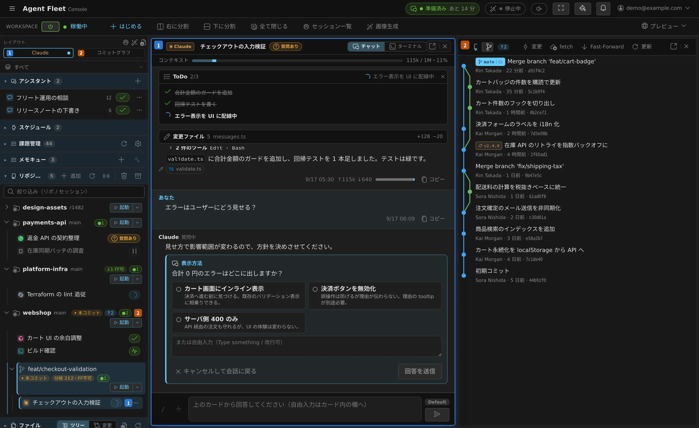
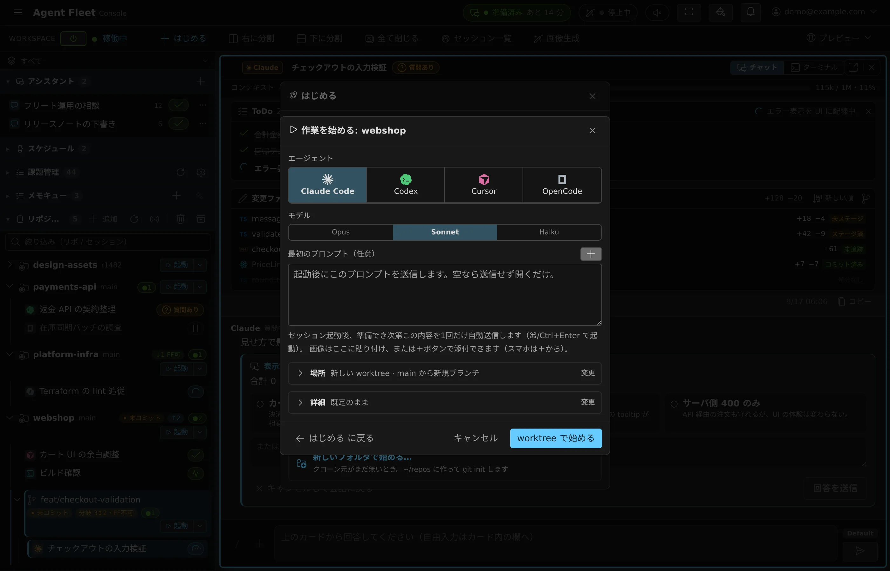
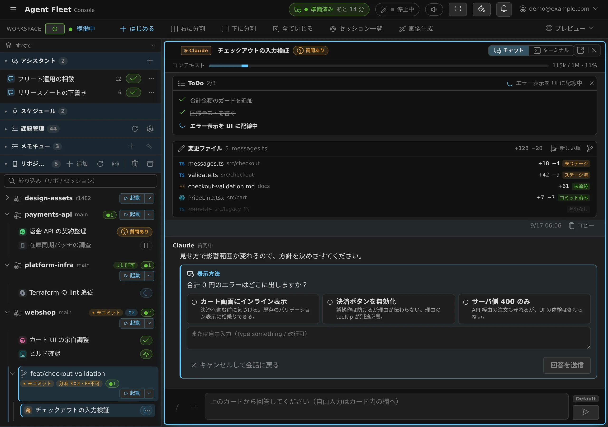
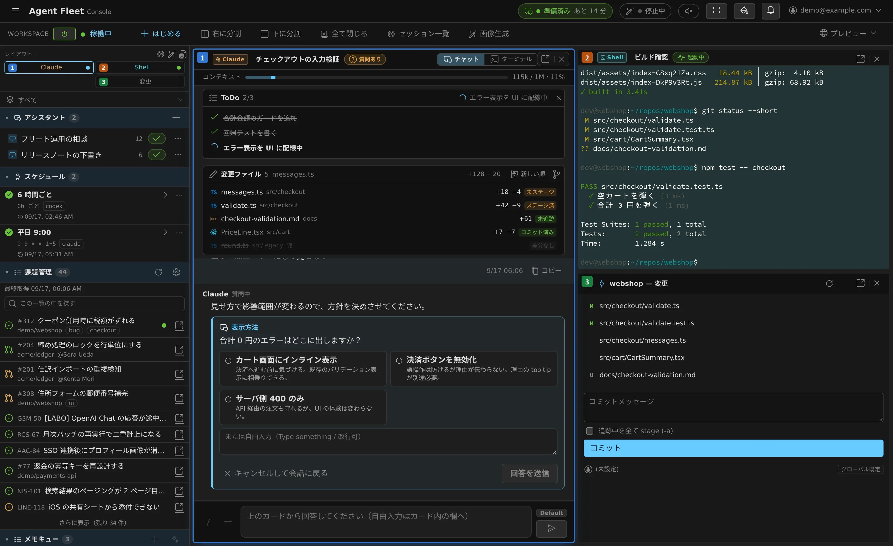
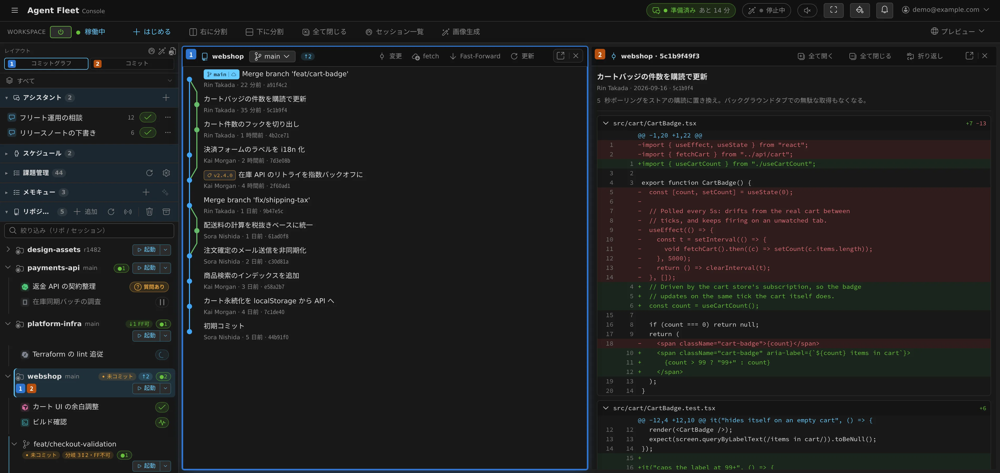
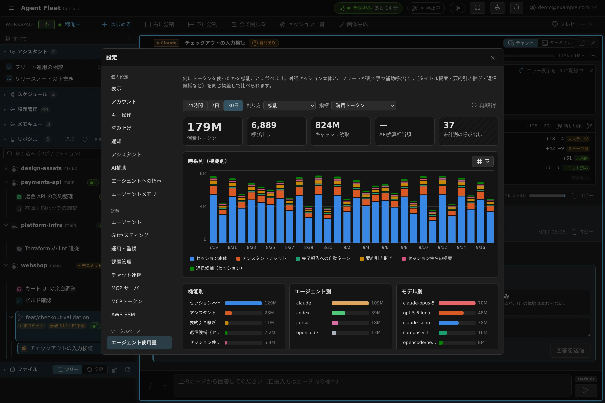
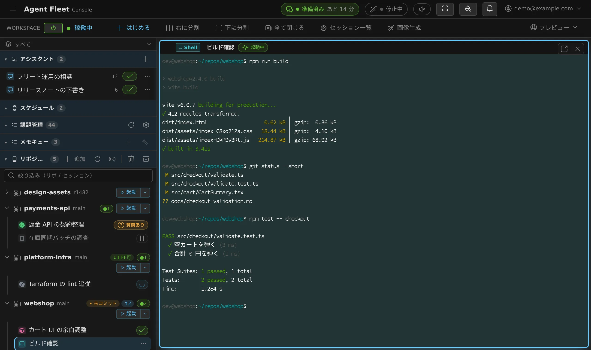

# Agent Fleet — AI コーディングエージェントをチームで動かす、自社ホストのコンソール

[English](README.md) | 日本語



**ノートを閉じても、エージェントは動き続けます。**

Agent Fleet は、AI コーディングエージェント——Claude Code / Codex CLI / GitHub Copilot
CLI / Antigravity CLI / Cursor CLI / Kiro / OpenCode——を、チームでブラウザから共有して
使うためのサービスです。メンバーごとに隔離された環境（cgroup で CPU とメモリを制限した
Docker コンテナ、Docker を使わない native 版では bubblewrap のサンドボックス）が与えられ、
そこに持続するホームと自分の作業コピーがあります。セッションの起動も、追跡も、操縦も
ブラウザから。端末の前に張り付く必要はなく、進み具合の確認と次の指示は Discord・Slack・
スマートフォンからでも行えます。

**自社でホストします。**1 社 1 配備で、自分たちのインフラの上で動くので、資格情報も
ソースも会話も外に出ません。同じ中身が、Docker Compose の Linux 1 台でも AWS ECS でも
動きます。

## 画面を眺める

| | |
|---|---|
|  |  |
| **起動はこのダイアログ 1 つ** — エージェント、モデル、推論の深さ、開始モード、そして新しい git worktree で動かすか作業コピーのままか。 | **ブラウザから追って、操縦する** — 質問・プラン・許可確認がカードで届き、その場で答えられます。 |
|  |  |
| **ペインを並べる** — ミラー・端末・作業ツリーの変更を横に並べられ、それぞれ別タブに出すこともできます。 | **本物の git を Console で** — コミットグラフと選んだコミットの差分、ステージとコミットまで、作業コピー・worktree ごとに。 |
|  |  |
| **トークンの行き先が見える** — 機能別・エージェント別・モデル別に、24 時間 / 7 日 / 30 日で。トークンを報告しない呼び出しは 0 とせず、別に数えます。 | **本物の端末もある** — エージェントでも素の shell でも、どのセッションも生の端末として開けます。 |

画面の言葉は日本語と英語を利用者ごとに ⚙設定で切り替えます。上のどの画面も英語版が
あります（`docs/img/*-en.webp`、たとえば [Console](docs/img/console-en.webp)）。

## 試す

どのエディションが合うかは 20 分で決められます。判断材料は
[デプロイ形態を選ぶ](guide/operate/01-choose.ja.md)にまとめてあります。

| エディション | 向いている相手 |
|---|---|
| **compose** | 既定。Docker の載った Linux 1 台で、チームで使う |
| **native** | Docker が入れられない・1 人で使う（WSL2、個人の Linux） |
| **ecs / ecs-ec2** | AWS で、タスク単位の隔離が要る |
| **ec2-single** | AWS で小規模。EC2 1 台に compose を載せる |

リリース版は GHCR のピンされたイメージを取得する形で
[配布リポジトリ](https://github.com/k-k1/agent-fleet-dist)に公開しています。コマンドの
手順書は、操作する対象の隣に置いてあります（[compose](deploy/compose/README.md) /
[native](deploy/native/README.md) / [AWS](deploy/aws/ecs/README.md)）。
このツリーからイメージを自分で組む場合——開発中はこちらです:

```bash
cd deploy/compose
cp .env.example .env     # 秘密（AF_MASTER_KEY など）を生成して埋める
docker build -t agent-fleet/workspace:dev ../../workspace   # 利用者ごとのワークスペース像
docker compose up -d --build
```

TLS は Caddy が Let's Encrypt で自動取得し、サインインは Control Plane 自身の OAuth を
使います。各手順が何を決めているのか、その後何に気をつけるのかは
[配備の運用](guide/operate/README.ja.md)にあります。

## ドキュメント

文書は読者で分かれていて、その分かれ方がそのまま配布の単位でもあります。

| あなたは | 読むもの |
|---|---|
| Agent Fleet を使う人 | **[guide/](guide/README.ja.md)** — やり方。**このツリーがワークスペースのコンテナへ配られ**、Console の**「利用ガイド」**が開くのもここです |
| コードを変える人 | **[docs/](docs/README.ja.md)** — どう動いているか、なぜそうなったか |

コードは [`workspace/`](workspace/)（エージェントとそのイメージ）・
[`control-plane/`](control-plane/)・[`console/`](console/) の 3 つ。手元の開発スタックは
[`deploy/local/run-dev.sh`](deploy/local/run-dev.sh)（`local` = Docker / `wsl` / `native` /
`reset`）で起動します。説明は [10 開発](docs/build/10-development.ja.md)。

## 用語

- **ワークスペース** — 利用者 1 人ぶんの、持続するコンテナ環境。ホームのボリュームと
  動いているプロセスを持ちます。
- **作業コピー** — ワークスペースの中にクローンした git リポジトリの作業ディレクトリ。
- **セッション** — 会話・設定・実行状態をまとめた論理単位で、作業コピーに結びついています。
  端末があるとは限りません: Codex / OpenCode / Copilot / Cursor / Kiro は既定で
  **マネージド**実行（会話画面から操る。Codex と OpenCode はセッションごとの CLI プロセス
  すら持たない共有ランタイムで動きます）で、Claude / Antigravity と素の shell / SSM が
  端末を使います。

## ライセンス

[Apache License 2.0](LICENSE)（寛容型・特許許諾つき）。資格情報を扱う道具のソースを
公開し、暗号と隔離の実装を各社が監査できるようにしておくこと自体を、採用の理由の 1 つと
考えています。コントリビューション: [CONTRIBUTING.md](CONTRIBUTING.md)、
脆弱性の報告と脅威モデル: [SECURITY.md](SECURITY.md)。
