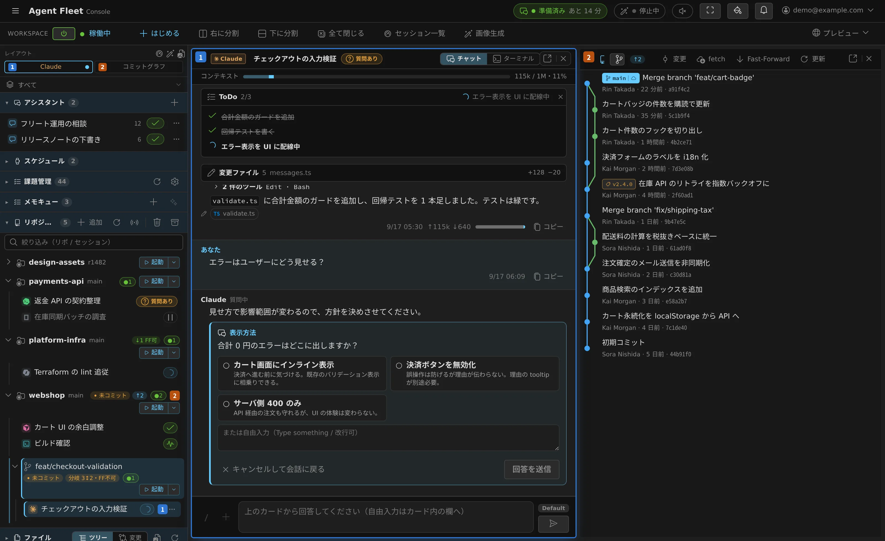
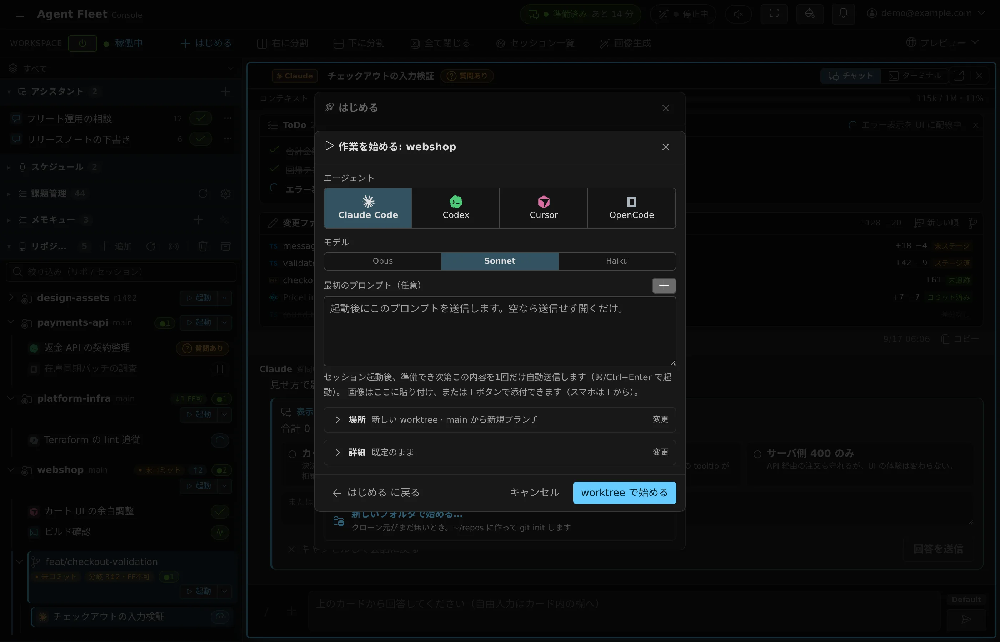
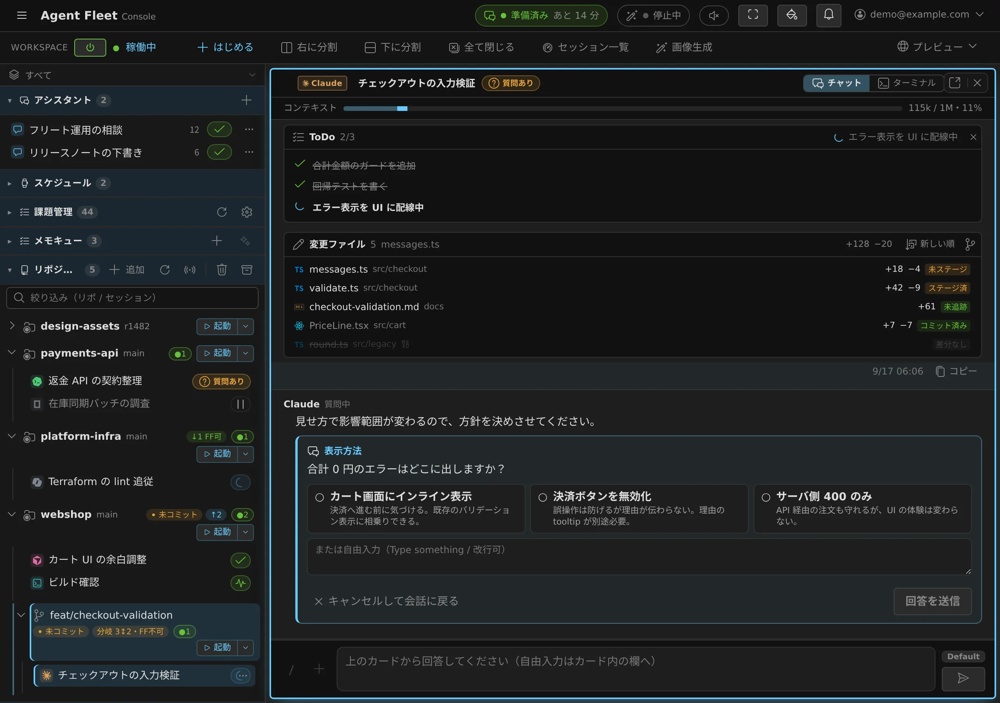
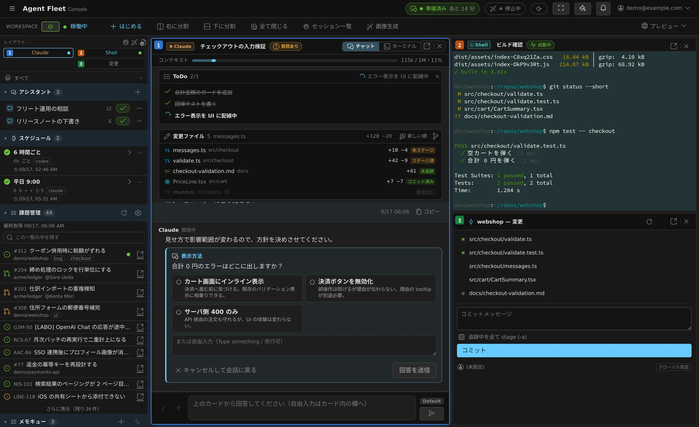
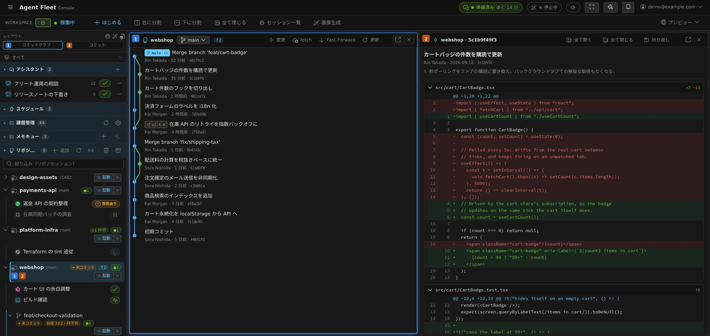
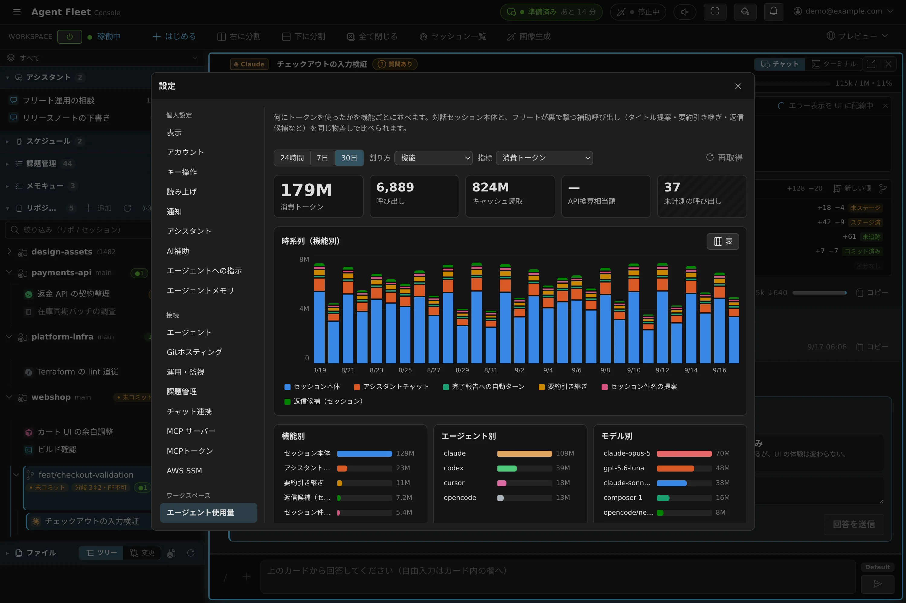
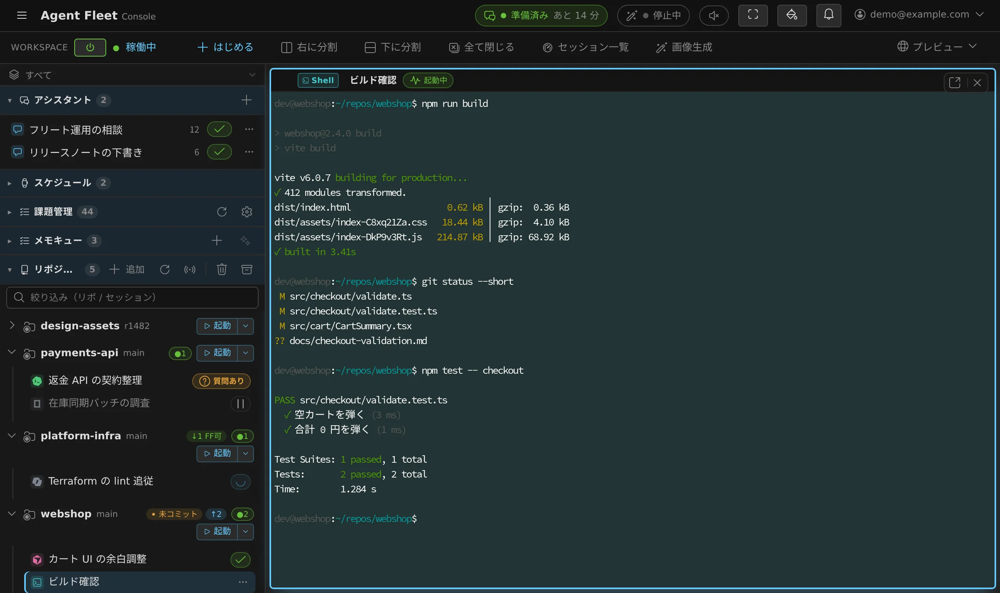

# Agent Fleet — AI コーディングエージェントを運用する、自社ホストの基盤

[English](README.md) | 日本語

**エージェントは置き換えない。運用する。**



Agent Fleet は、新しいエージェントフレームワークではありません。Claude Code は
Claude Code のまま、Codex は Codex のまま——いま使っている CLI を、そのログイン・
モデル・振る舞いごとそのまま動かします。Agent Fleet が引き受けるのはその周りです。
メンバーごとに持続し隔離された環境、本物の git の作業コピーと worktree、ブラウザから
追って操縦できるセッション、質問と許可確認、使用量、スケジュール、そして遠隔からの
操作。**ノートを閉じても、エージェントは動き続けます。**

いま扱えるエージェント: Claude Code / Codex CLI / GitHub Copilot CLI / Antigravity CLI /
Cursor CLI / Kiro / OpenCode / Muse Code、そしてフリート自身の llama.cpp ハーネス。

**自社でホストします。**1 社 1 配備で、自分たちのインフラの上で動くので、資格情報も
ソースも会話も外に出ません。メンバーの環境は cgroup で CPU とメモリを制限した Docker
コンテナ（Docker を使わない native 版では bubblewrap のサンドボックス）です。同じ中身が、
Docker Compose の Linux 1 台でも AWS ECS でも動きます。

## Agent Fleet のある一日

1. 朝、Claude Code と Codex に別々の Issue を頼む。それぞれ自分の git worktree で。
2. ノートを閉じて出かける。どちらもサーバーの上で作業を続ける。
3. 片方が許可を求める。その依頼はセッションごとの Slack スレッドに届き、スマートフォン
   から答える。
4. 机に戻ると、セッション一覧でどれが終わり、どれがあなたを待っているかが分かり、
   各 worktree の変更はワンクリックで開ける。

## 1 つの会話ではなく、フリートとして運用する

- **何本ものセッションを同時に** — エージェントの種類をまたいで、それぞれ自分の worktree
  で。作業中か、質問・プラン・許可確認であなたを待っているかが 1 つの一覧で分かります。
- **セッションがセッションを起こす** — レビューを別の種類のエージェントに渡し、終わったら
  報告を 1 本受け取れます。フリートグラフに、誰が誰を起こし、何をやり取りしたかが描かれ
  ます。
- **人がいなくても進む** — スケジュール実行は止まっているワークスペースを起こして走り、
  使用量の上限で切れたターンは上限が明けると再開します。
- **どこからでも** — セッションごとの Discord / Slack スレッドで、返信して操縦し、ボタンで
  答えられます。Console はスマートフォンのブラウザでも使えます。
- **費用を 1 つの物差しで** — トークンを機能別・エージェント別・モデル別に。トークンを
  報告しない呼び出しはゼロではなく「未計測」として数えます。

## 上流の変化に耐えるように作っている

エージェントの CLI は数日おきに変わります。9 種類に対応していても、その対応が続かなければ
意味がありません。そこで:

- どの CLI も、検証済みの版でワークスペースのイメージに**固定**しています。自動更新は
  オプトインです。
- 毎日の監視が CLI の新しい版の公開に気づき、**実物の CLI を動かす契約テスト**——対話
  TUI も含めて——を走らせ、Agent Fleet が頼っている振る舞いを確かめます。
- 「新しい版を見た」と「試した」は別々に記録するので、契約を通っていない版を通った版と
  取り違えることはありません。

2 つの仕組みの組み合わせ方: [上流 CLI の破壊検知](docs/build/10-development.ja.md#上流-cli-の破壊検知版ドリフト監視--contract-テスト)

## 画面を眺める

| | |
|---|---|
|  |  |
| **起動はこのダイアログ 1 つ** — エージェント、モデル、推論の深さ、開始モード、そして新しい git worktree で動かすか作業コピーのままか。 | **ブラウザから追って、操縦する** — 質問・プラン・許可確認がカードで届き、その場で答えられます。 |
|  |  |
| **ペインを並べる** — ミラー・端末・作業ツリーの変更を横に並べられ、それぞれ別タブに出すこともできます。 | **本物の git を Console で** — コミットグラフと選んだコミットの差分、ステージとコミットまで、作業コピー・worktree ごとに。 |
|  |  |
| **トークンの行き先が見える** — 機能別・エージェント別・モデル別に、24 時間 / 7 日 / 30 日で。トークンを報告しない呼び出しは 0 とせず、別に数えます。 | **本物の端末もある** — エージェントでも素の shell でも、どのセッションも生の端末として開けます。 |

画面の言葉は日本語と英語を利用者ごとに ⚙設定で切り替えます。上のどの画面も英語版が
あります（`docs/img/*-en.webp`、たとえば [Console](docs/img/console-en.webp)）。

## 試す

どのエディションが合うかは 20 分で決められます。判断材料は
[デプロイ形態を選ぶ](guide/operate/01-choose.ja.md)にまとめてあります。

| エディション | 向いている相手 |
|---|---|
| **compose** | 既定。Docker の載った Linux 1 台で、チームで使う |
| **native** | Docker が入れられない・1 人で使う（WSL2、個人の Linux） |
| **ecs / ecs-ec2** | AWS で、タスク単位の隔離が要る |
| **ec2-single** | AWS で小規模。EC2 1 台に compose を載せる |

リリース版は GHCR のピンされたイメージを取得する形で
[配布リポジトリ](https://github.com/k-k1/agent-fleet-dist)に公開しています。コマンドの
手順書は、操作する対象の隣に置いてあります（[compose](deploy/compose/README.md) /
[native](deploy/native/README.md) / [AWS](deploy/aws/ecs/README.md)）。
このツリーからイメージを自分で組む場合——開発中はこちらです:

```bash
cd deploy/compose
cp .env.example .env     # 秘密（AF_MASTER_KEY など）を生成して埋める
docker build -t agent-fleet/workspace:dev ../../workspace   # 利用者ごとのワークスペース像
docker compose up -d --build
```

TLS は Caddy が Let's Encrypt で自動取得し、サインインは Control Plane 自身の OAuth を
使います。各手順が何を決めているのか、その後何に気をつけるのかは
[配備の運用](guide/operate/README.ja.md)にあります。

## ドキュメント

文書は読者で分かれていて、その分かれ方がそのまま配布の単位でもあります。

| あなたは | 読むもの |
|---|---|
| Agent Fleet を使う人 | **[guide/](guide/README.ja.md)** — やり方。**このツリーがワークスペースのコンテナへ配られ**、Console の**「利用ガイド」**が開くのもここです |
| コードを変える人 | **[docs/](docs/README.ja.md)** — どう動いているか、なぜそうなったか |

コードは [`workspace/`](workspace/)（エージェントとそのイメージ）・
[`control-plane/`](control-plane/)・[`console/`](console/) の 3 つ。手元の開発スタックは
[`deploy/local/run-dev.sh`](deploy/local/run-dev.sh)（`local` = Docker / `wsl` / `native` /
`reset`）で起動します。説明は [10 開発](docs/build/10-development.ja.md)。

## 用語

- **ワークスペース** — 利用者 1 人ぶんの、持続するコンテナ環境。ホームのボリュームと
  動いているプロセスを持ちます。
- **作業コピー** — ワークスペースの中にクローンした git リポジトリの作業ディレクトリ。
- **セッション** — 会話・設定・実行状態をまとめた論理単位で、作業コピーに結びついています。
  端末があるとは限りません: Codex / OpenCode / Copilot / Cursor / Kiro は既定で
  **マネージド**実行（会話画面から操る。Codex と OpenCode はセッションごとの CLI プロセス
  すら持たない共有ランタイムで動きます）、llama.cpp と Muse Code はマネージド実行だけで、
  Claude / Antigravity と素の shell / SSM が端末を使います。

## ライセンス

[Apache License 2.0](LICENSE)（寛容型・特許許諾つき）。資格情報を扱う道具のソースを
公開し、暗号と隔離の実装を各社が監査できるようにしておくこと自体を、採用の理由の 1 つと
考えています。コントリビューション: [CONTRIBUTING.md](CONTRIBUTING.md)、
脆弱性の報告と脅威モデル: [SECURITY.md](SECURITY.md)。
