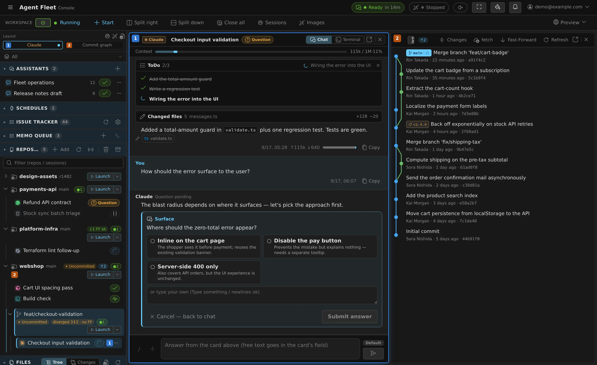
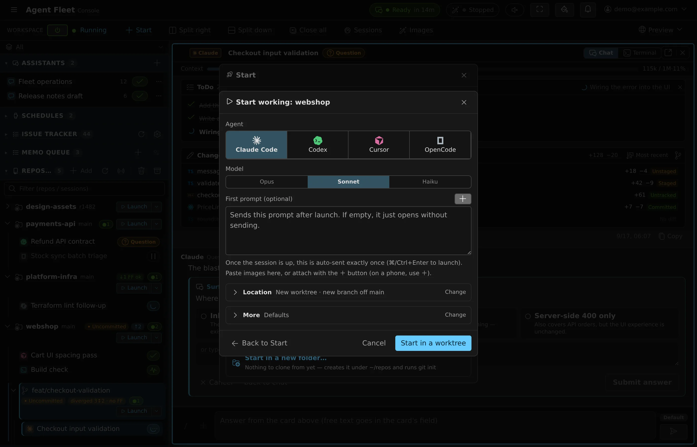
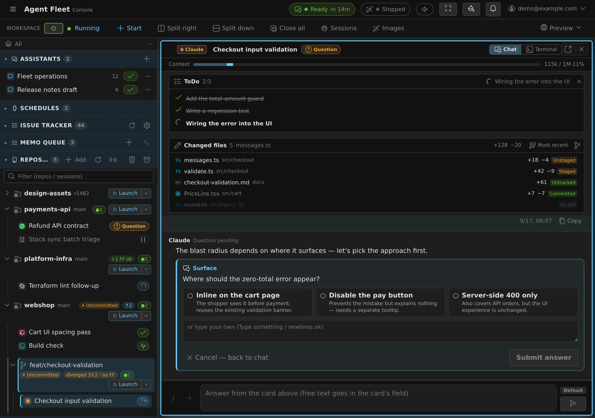
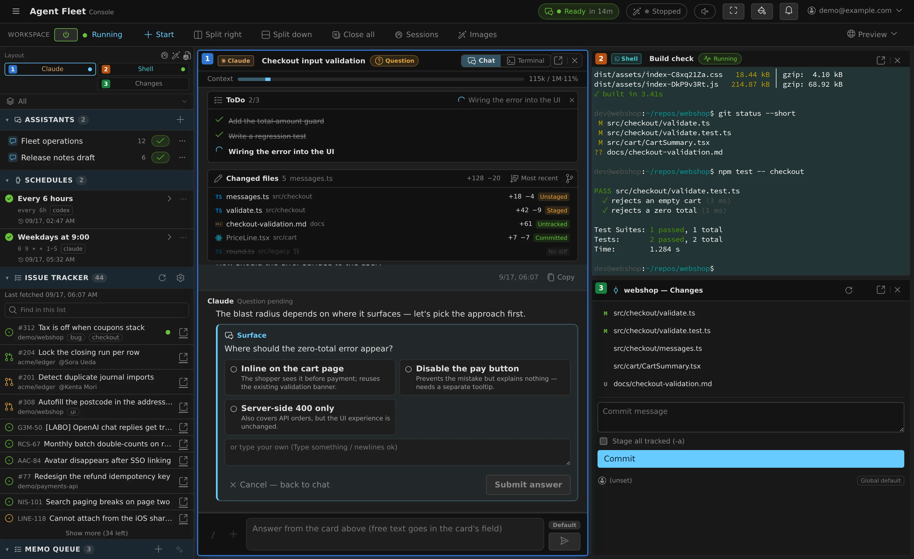
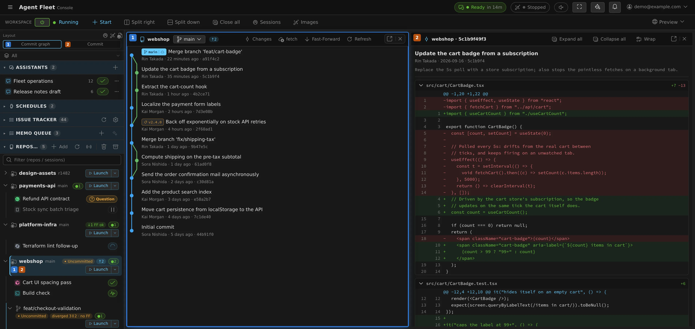
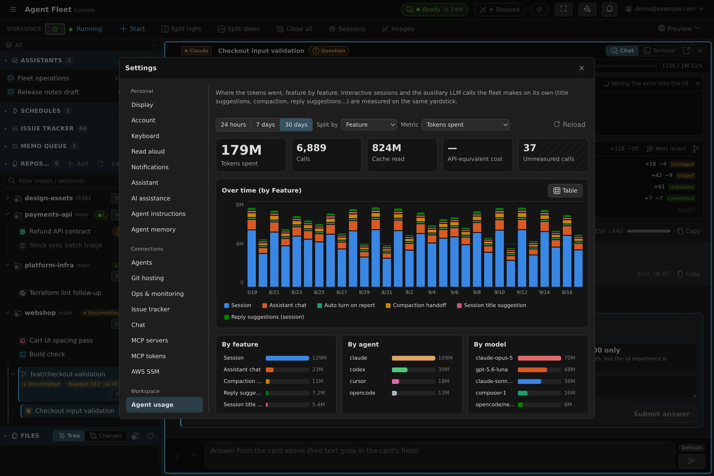
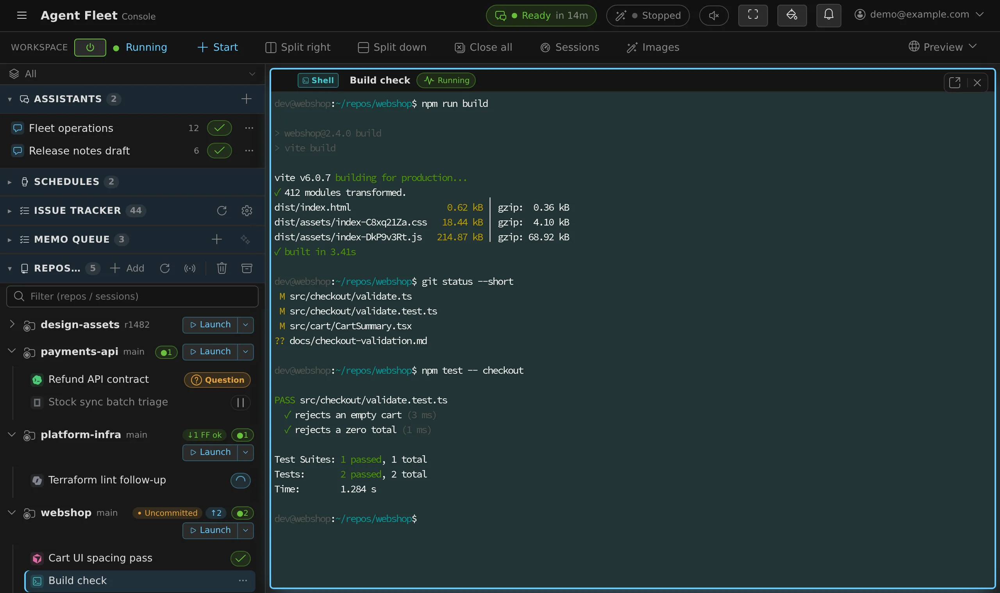

# Agent Fleet — a self-hosted console for running AI coding agents as a fleet



Agent Fleet is a web service that lets a team share AI coding agents — Claude Code,
Codex CLI, GitHub Copilot CLI, Antigravity CLI, Cursor CLI, Kiro, OpenCode — efficiently and safely.
Each member gets an isolated per-user environment — a Docker container with cgroup
CPU/memory quotas (or a bubblewrap sandbox in the Docker-less native runtime) — with
a persistent home and git working copies, and starts, drives and manages agent
sessions from the browser. A Go control plane orchestrates the workspaces; the same
core runs **both locally (Docker) and on AWS ECS (CloudFormation)** — the deployment
layer is separated via ports & adapters ([portability](docs/build/09-deploy.md)).

**Status: Phase 2 complete, Phase 3 in progress.** Multiple users can work in
parallel, mutually invisible, on a single on-prem host (per-user Workspace /
AuthGateway / network isolation / at-rest encryption). Phase 3 productization has
reached the packaging & distribution milestone (P3-10): the full Console rebuild
(React+Vite), the AWS ECS adapter (P3-7) and the compose / ECS / Docker-less native
distribution targets are shipped, with 0.x releases published to the
[distribution repo](https://github.com/k-k1/agent-fleet-dist)
([docs/log/p3-10-packaging.md](docs/log/p3-10-packaging.md),
[docs/roadmap.md](docs/roadmap.md)).
**Documentation starts at [docs/README.md](docs/README.md)**, which branches by
reader. (`docs/HANDOFF.md` is the development host's own runtime state and pitfalls —
useful if you are working on *this* host, not an entry point for the project.)
Code: [`workspace/`](workspace/) (Agent + image) / [`control-plane/`](control-plane/) /
[`console/`](console/); start via [`deploy/local/run-dev.sh`](deploy/local/run-dev.sh)
(subcommands: `local` = Docker default / `wsl` = WSL preset / `native` = no Docker /
`reset` = wipe data. [docs/build/10 §10.3](docs/build/10-development.md)).

## Self-hosting (on-prem / Docker Compose)

Each company runs one deployment on its own infrastructure. Just `compose up` the
image set (Caddy handles automatic TLS via Let's Encrypt; login uses the CP-native
Google OAuth).

```bash
cd deploy/compose
cp .env.example .env     # generate and fill in secrets (AF_MASTER_KEY etc.)
docker build -t agent-fleet/workspace:dev ../../workspace   # per-user workspace image
docker compose up -d --build
```

The snippet above builds the images from this tree, which is what you want while
developing. A **release** is consumed the other way round: the bundle from the
[distribution repo](https://github.com/k-k1/agent-fleet-dist) pulls pinned images from
GHCR ([decisions/0037](docs/decisions/0037-registry-policy.md)).

Procedures, key generation, backup/restore, upgrades, incident response and DooD
constraints are collected in **[deploy/compose/README.md](deploy/compose/README.md)
(runbook)**. Local dev (host processes) remains
[`deploy/local/run-dev.sh`](deploy/local/run-dev.sh); personal WSL use (with or
without Docker) is covered by
[deploy/local/README-wsl.md](deploy/local/README-wsl.md).

## A look around

| | |
|---|---|
|  |  |
| **Start anything from one dialog** — agent, model, reasoning effort, start mode, and a fresh git worktree or the working copy as-is. | **Follow and steer from the browser** — questions, plans and permission prompts arrive as cards you answer in place. |
|  |  |
| **Split panes** — mirror, live terminal and working-tree changes side by side; each pane can also pop out into its own tab. | **Real git, in the console** — commit graph beside the selected commit's diff, plus staging and commit, per working copy and worktree. |
|  |  |
| **See where the tokens went** — per feature, per agent and per model, over 24h / 7d / 30d. Calls that report no tokens are counted separately, never as zero. | **A real terminal, too** — every session (agent or plain shell) is attachable as a live PTY. |

The UI is English or Japanese, switched per user in ⚙ Settings — every view above also
exists in Japanese (`docs/img/*-ja.webp`, e.g.
[the console](docs/img/console-ja.webp)). Screenshots are captured from the real
Console bundle against a demo dataset — regenerate them with
`node console/scripts/shots/capture.mjs --locale en` (the default locale is `ja`;
[how](console/scripts/shots/README.md)).

## Settled assumptions (v1)

| Topic | Decision | Rationale / notes |
|------|------|-----------|
| Agent auth | each user connects their own account/seat from the Console (Claude: OAuth code paste; Codex: ChatGPT device code or API key; Copilot rides the GitHub connection; Cursor / Kiro: browser sign-in; OpenCode: provider API keys or an opencode account) | the console surfaces each user's auth state and prompts re-login; a manual `/login` in the terminal still works as a fallback |
| User isolation | one container per user | highly portable, strong isolation, fits AWS well |
| Target scale | ~20 users (concurrent) | a single cluster + an orchestration layer is enough |
| Persistence | `local`=bind mount / `aws`=EBS/EFS | home, clones, credentials and history are kept on disk |
| Git auth | HTTPS tokens/OAuth via Console (Connections) | downgraded from SSH keys; the CP holds no secrets ([decisions/0003](docs/decisions/0003-ssh-to-connections.md)) |
| Tech stack | Console=React+Vite / Backend=Go | Go suits daemons, WS proxying and container control ([decisions/0004](docs/decisions/0004-vanilla-to-react.md)) |
| Delivery model | packaged product, self-hosted per company | 1 company = 1 deployment. SaaS abandoned due to ToS ([decisions/0001](docs/decisions/0001-self-host-vs-saas.md)) |
| Deployment layer | local / aws switchable over one core | separated via ports & adapters (local = Docker, local-first) |

## Documentation layout

Everything starts at **[docs/README.md](docs/README.md)**, which branches by reader.
The shelves are cut by *who reads them*, and that is also how they ship: a container
receives only the shelves its user's role may see.

| Shelf | Reader |
|---|---|
| [docs/use/](docs/use/README.md) | using Agent Fleet to run agents |
| [docs/admin/](docs/admin/README.md) | administering a tenant |
| [docs/operate/](docs/operate/README.md) | installing and operating a deployment |
| [docs/build/](docs/build/README.md) | changing the code |
| [docs/ref/](docs/ref/README.md) | what the product can do — shared by all four |
| [docs/decisions/](docs/decisions/) | why it is like this, including the discarded options |

[docs/CONVENTIONS.md](docs/CONVENTIONS.md) is the norm every file follows;
`scripts/docs-check.py` enforces it in CI.

> The work journals that used to be `docs/NN-*.md` are frozen in
> [docs/log/](docs/log/README.md); they are not maintained and not shipped.

## Existing prototype assets (reused from)

A personal fleet-operation setup already existed; this project turns it into a
product.

- **`oauth2-proxy`** — Google domain-restricted auth gate (`emails.txt` allowlist).
  **Now replaced by CP-native Google OAuth (`AUTH=oauth`)** — the allowlist is
  `deploy/local/allowed-emails.txt` (emails / `@domain`). Design:
  [docs/build/07 §7.3](docs/build/07-security.md)
- **`scripts/tmux-claude.sh`** — idempotently starts, resumes and generation-manages
  multiple Claude CLIs in detached tmux
- **`CLAUDE_CONFIG_DIR` profile separation** — per-directory separate `~/.claude`
- **`~/.claude/settings.json`** — `remoteControlAtStartup` /
  `skipDangerousModePermissionPrompt` preconfigured

## Terminology

- **Workspace** — the persistent container environment for one user, with a home
  volume and running processes.
- **Working copy** — the working directory of a git repository cloned inside a
  Workspace.
- **Session** — the logical unit of a conversation, its settings and execution state,
  tied to a working copy. It does not imply a terminal: Codex / OpenCode / Copilot /
  Cursor / Kiro default to a **managed** execution method driven from the chat view
  (Codex and OpenCode run on a shared runtime with no per-session CLI process at all),
  while Claude / Antigravity and the plain shell / SSM sessions use a terminal.

## License

[Apache License 2.0](LICENSE) (permissive, with a patent grant). Publishing the
source of a credential-handling tool so each company can audit the crypto/isolation
implementation is part of the adoption pitch. Contributions:
[CONTRIBUTING.md](CONTRIBUTING.md); vulnerability reports and the threat model:
[SECURITY.md](SECURITY.md).
