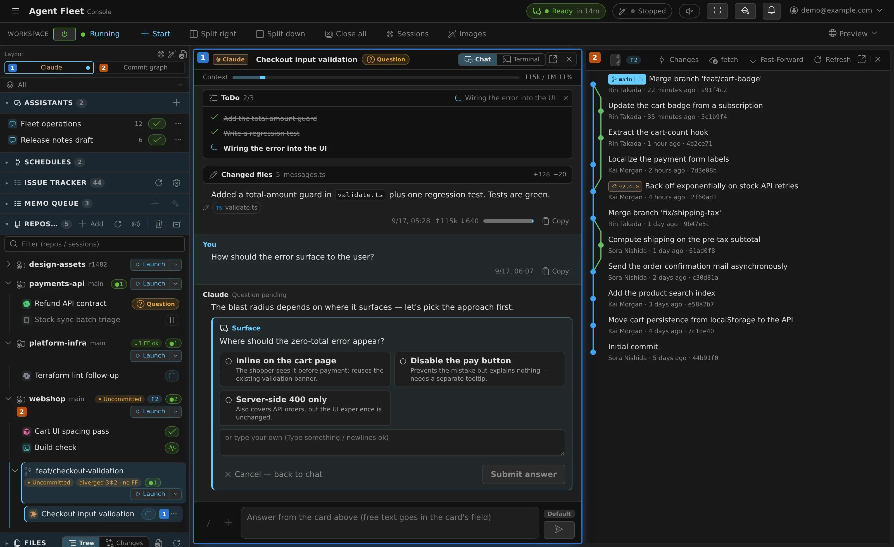
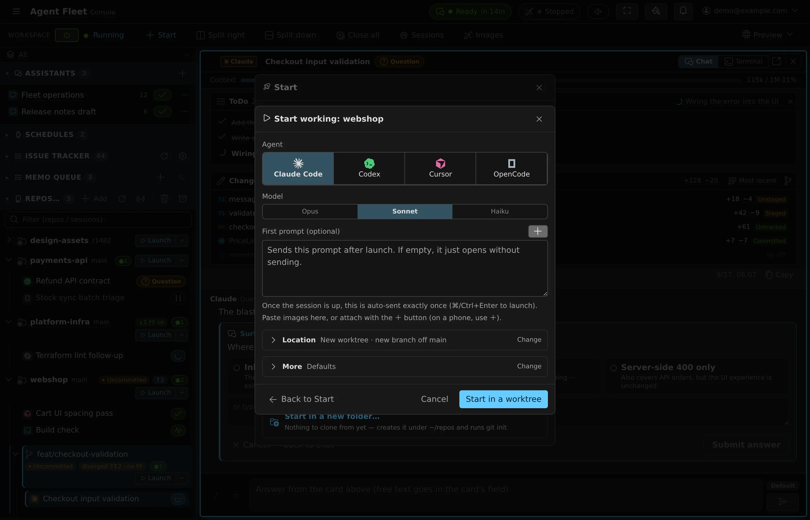
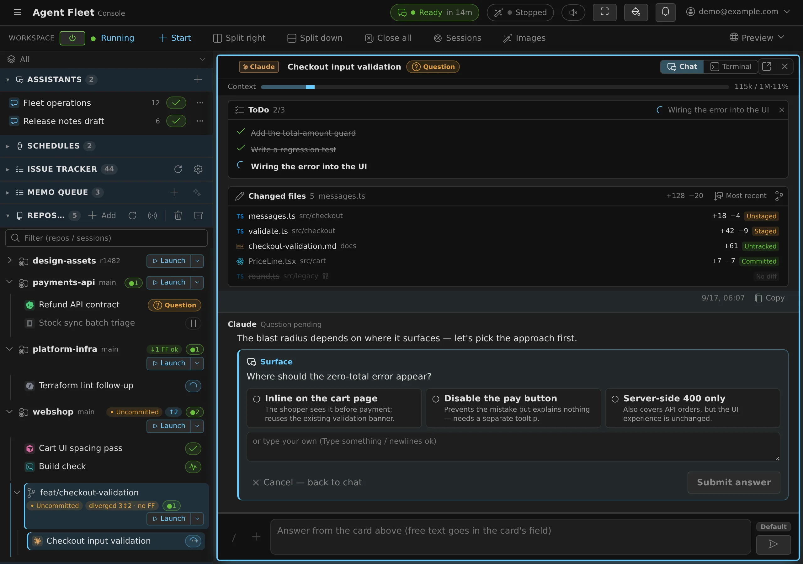
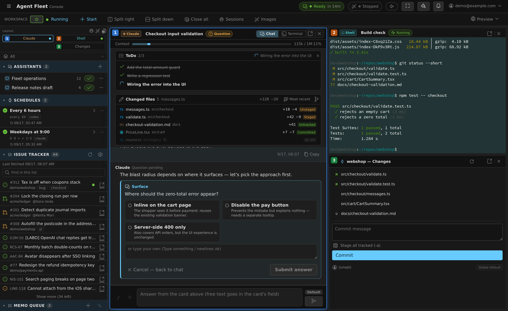
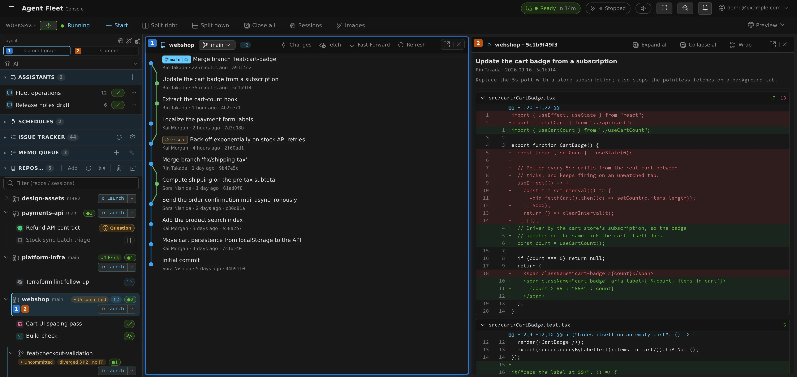
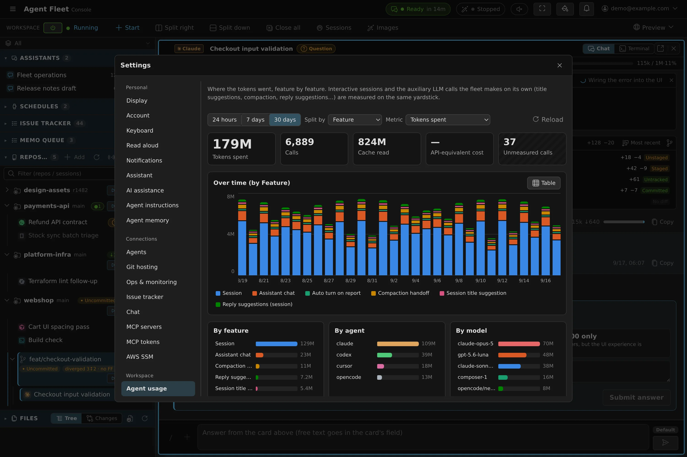
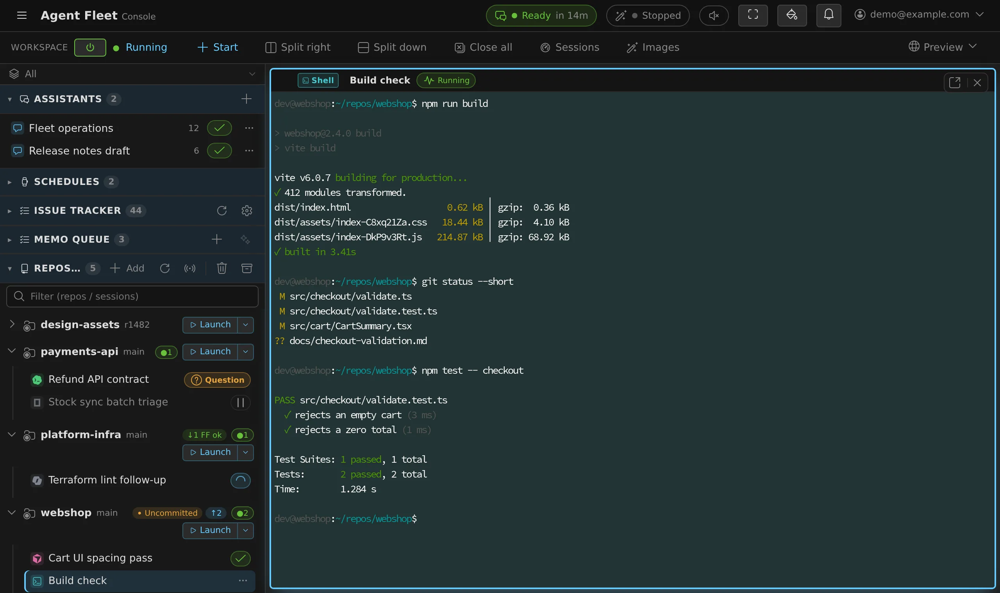

# Agent Fleet — a self-hosted operations layer for AI coding agents

English | [日本語](README.ja.md)

**Don't replace your coding agents. Operate them.**



Agent Fleet is not another agent framework. Claude Code stays Claude Code and Codex stays
Codex: the CLIs you already use run as they are, with their own sign-in, models and
behaviour. What Agent Fleet takes on is everything around them — a persistent, isolated
environment per member, real git working copies and worktrees, sessions you follow and
steer from a browser, questions and permission prompts, usage, schedules, and remote
control. **Close your laptop. The agents keep working.**

Supported today: Claude Code, Codex CLI, GitHub Copilot CLI, Antigravity CLI, Cursor CLI,
Kiro, OpenCode, Muse Code, and the fleet's own llama.cpp harness.

It is **self-hosted**. One company runs one deployment on its own infrastructure, so the
credentials, the source and the conversations stay inside it. Each member's environment is
a Docker container with cgroup CPU/memory quotas (or a bubblewrap sandbox in the
Docker-less native edition). The same core runs on a single Linux host with Docker Compose
and on AWS ECS.

## A day with Agent Fleet

1. In the morning, hand one issue to Claude Code and another to Codex, each in its own git
   worktree.
2. Close the laptop and leave. Both keep working on the server.
3. One of them asks for permission. The request arrives in that session's Slack thread,
   and you answer it from your phone.
4. Back at a desk, the session list shows which sessions finished and which are waiting on
   you, and each worktree's changes are a click away.

## Operate a fleet, not a single chat

- **Many sessions at once** — across agent kinds, each in its own worktree. One list shows
  which are working and which wait on a question, a plan or a permission prompt.
- **Sessions that start sessions** — a session can hand a review to another agent kind and
  get one report back; the fleet graph draws who started whom and what passed between
  them.
- **Unattended work** — scheduled runs wake a stopped workspace, and a turn cut short by a
  usage limit resumes when the limit lifts.
- **From anywhere** — a Discord / Slack thread per session, where you reply to steer and
  answer with buttons; the Console works in a phone's browser.
- **One yardstick for spend** — tokens per feature, per agent and per model, with calls
  that report no tokens counted as unmeasured rather than free.

## Built to survive upstream changes

Agent CLIs change every few days, and supporting nine of them is only worth something if
the support keeps working. So:

- Every CLI is **pinned** in the workspace image to a version that was verified;
  self-update is opt-in.
- A daily watcher notices when a CLI publishes a new version and dispatches a **contract
  test that drives the real CLI**, its interactive TUI included, against what Agent Fleet
  depends on.
- "We saw a new version" and "we tested it" are recorded separately, so a release that
  has not passed its contract is never mistaken for one that has.

How the two halves fit together: [Detecting upstream CLI breakage](docs/build/10-development.md#detecting-upstream-cli-breakage).

## A look around

| | |
|---|---|
|  |  |
| **Start anything from one dialog** — agent, model, reasoning effort, start mode, and a fresh git worktree or the working copy as-is. | **Follow and steer from the browser** — questions, plans and permission prompts arrive as cards you answer in place. |
|  |  |
| **Split panes** — mirror, live terminal and working-tree changes side by side; each pane can also pop out into its own tab. | **Real git, in the console** — commit graph beside the selected commit's diff, plus staging and commit, per working copy and worktree. |
|  |  |
| **See where the tokens went** — per feature, per agent and per model, over 24h / 7d / 30d. Calls that report no tokens are counted separately, never as zero. | **A real terminal, too** — every session (agent or plain shell) is attachable as a live PTY. |

The UI is English or Japanese, switched per user in ⚙ Settings — every view above also
exists in Japanese (`docs/img/*-ja.webp`, e.g. [the console](docs/img/console-ja.webp)).

## Trying it

Which edition suits you is a twenty-minute decision, laid out in
[Choosing a deployment target](guide/operate/01-choose.md):

| Edition | For |
|---|---|
| **compose** | the default — a team, on one Linux host with Docker |
| **native** | no Docker available; single user (WSL2, a personal Linux box) |
| **ecs / ecs-ec2** | AWS, when you want task-level isolation |
| **ec2-single** | AWS, small team — compose on one VM |

Released bundles pull pinned images from GHCR and are published to the
[distribution repository](https://github.com/k-k1/agent-fleet-dist); the command
procedures live next to what they operate ([compose](deploy/compose/README.md),
[native](deploy/native/README.md), [AWS](deploy/aws/ecs/README.md)). To build the images
from this tree instead — which is what you want while developing:

```bash
cd deploy/compose
cp .env.example .env     # generate and fill in secrets (AF_MASTER_KEY etc.)
docker build -t agent-fleet/workspace:dev ../../workspace   # per-user workspace image
docker compose up -d --build
```

Caddy handles TLS via Let's Encrypt; sign-in uses the control plane's own OAuth. What
each step decides, and what to watch out for afterwards, is in
[Operating a deployment](guide/operate/README.md).

## Documentation

Documents are split by reader, and the split is also how they ship.

| You are | Read |
|---|---|
| Using Agent Fleet | **[guide/](guide/README.md)** — how to do things. This is the tree that ships into every workspace container, and the Console opens it from **"User guide"** |
| Changing the code | **[docs/](docs/README.md)** — how it works, and why it is like this |

The code is [`workspace/`](workspace/) (the agent and its image),
[`control-plane/`](control-plane/) and [`console/`](console/); a local dev stack starts
with [`deploy/local/run-dev.sh`](deploy/local/run-dev.sh) (`local` = Docker, `wsl`, `native`,
`reset`), described in [10 Development](docs/build/10-development.md).

## Terminology

- **Workspace** — the persistent container environment for one user, with a home
  volume and running processes.
- **Working copy** — the working directory of a git repository cloned inside a
  Workspace.
- **Session** — the logical unit of a conversation, its settings and execution state,
  tied to a working copy. It does not imply a terminal: Codex / OpenCode / Copilot /
  Cursor / Kiro default to a **managed** execution method driven from the chat view
  (Codex and OpenCode run on a shared runtime with no per-session CLI process at all),
  llama.cpp and Muse Code are managed only, while Claude / Antigravity and the plain
  shell / SSM sessions use a terminal.

## License

[Apache License 2.0](LICENSE) (permissive, with a patent grant). Publishing the source of
a credential-handling tool so each company can audit the crypto and isolation
implementation is part of the pitch. Contributions: [CONTRIBUTING.md](CONTRIBUTING.md);
vulnerability reports and the threat model: [SECURITY.md](SECURITY.md).
