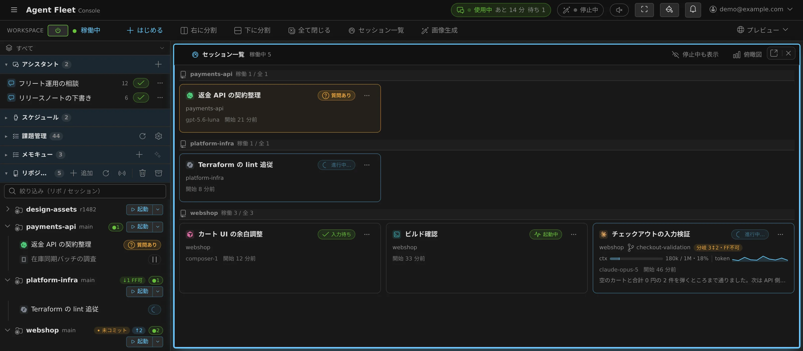
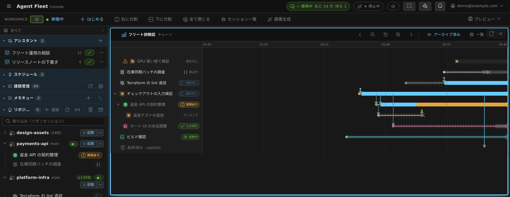

# 02. セッション — AI との会話を起動・切り替え・止める

[English](02-sessions.md) | 日本語

セッションは、AI に任せる 1 つの仕事を、**会話・作業場所・実行状態**ごとまとめた単位です。
ターミナルの有無とは別の概念で、Codex / opencode / GitHub Copilot / Kiro は黒い画面を持たない
マネージド実行でもセッションとして動きます。左ペインでは作業場所に対応する **リポジトリ** の下に並び、
リポジトリに属さないものは **その他のセッション** に並びます。複数のセッションを並行して
持て、それぞれが独立した会話・作業フォルダを持ちます。

## セッションの種類

- **claude** — Claude Code を起動。
- **codex** — Codex を起動。
- **cursor** — Cursor を起動（Cursor プランが必要。接続すると並びます — [06](06-agents.ja.md)）。
- **copilot** — GitHub Copilot を起動（GitHub 連携に相乗り — [06](06-agents.ja.md)）。
- **kiro** — Kiro を起動（デバイスフローのサインインが必要。接続すると並びます — [06](06-agents.ja.md)）。
- **agy** — Antigravity を起動（実験枠。接続すると並びます）。
- **opencode** — OpenCode を起動。
- **lcpp** — フリート自前の llama.cpp エンジンをマネージドのセッションとして起動（サインイン不要。
  ⚙設定 → エージェントの **「llama.cpp を使う」** がオンのあいだ「はじめる」に並びます — [06](06-agents.ja.md#lcpp)）。
- **muse** — Muse Code をマネージドのセッションとして起動（導入してサインインすると並びます — [06](06-agents.ja.md#muse-code)）。
- **shell** — 通常のシェル（bash）。「はじめる」からすぐ開けます。

claude / codex / cursor / opencode / copilot / kiro / agy は、対応するエージェントを接続すると「はじめる」に並びます
（接続は [06 エージェント](06-agents.ja.md)）。lcpp と muse は自前の端末を持たず、常にマネージドで
動きます。（別ホストへ入る **ssm** は
[10 一歩進んだ使い方](10-integrations.ja.md)。）

## 実行方式 — マネージドとターミナル（CLI）

Codex / cursor / opencode / GitHub Copilot / Kiro の開始画面では **実行方式**を選べます。これは Agent Fleet がエージェントを
動かし、指示を届ける経路（内部では「ドライバ」）の違いです。**同じ種類のセッションを
どう動かすか**を選ぶもので、会話の保存先や作業フォルダが別になるわけではありません。

- **マネージド（推奨・既定）** — Agent Fleet がエージェントを直接制御します。
  操作はチャット表示で行い、ターミナルはありません。Codex / opencode は共有の実行基盤で動き、
  セッション専用の CLI プロセスを持たないため省メモリで並行作業に向きます
  （GitHub Copilot・cursor・Kiro はマネージドでもセッションごとの専用プロセスで動くため、メモリは
  ターミナル（CLI）と同等です）。
- **ターミナル（CLI）** — エージェントの CLI をセッションごとに起動し、その対話画面を
  ターミナルから直接操作できます。CLI 固有の画面やコマンドが必要な場合向けで、セッションごとに
  追加のメモリを使います。

新しい Codex / cursor / opencode / GitHub Copilot / Kiro セッションはマネージドが既定です。claude / agy は
ターミナル（CLI）、shell / SSM はターミナル経路だけを使います。マネージド対応の種類は停止中でなく、エージェントが処理中でもないとき、
セッションの ⋯ メニューから実行方式を切り替えられます。**会話はそのまま引き継がれます**。
ターミナル（CLI）からチャット表示を開くこともできますが、マネージドにターミナル画面はありません。

ターミナル（CLI）の画面は、ブラウザを閉じても裏側で保持されます。保持の仕組みを
利用者が直接操作する必要はありません。

## 新規セッションを作る — 画面上部の「はじめる」

ワークスペース操作バーの **「＋ はじめる」** が起動の入り口です。押すと **「はじめる」** 画面が開き、
**どこで作業するか**から選びます。

- **チャット（アシスタント）** — リポジトリを使わない簡単なチャットを始めます
  （[07 チャットとメモ](07-chat-memo.ja.md)）。
- **リポジトリでエージェントを起動** — クローン済みのリポジトリを検索して選ぶと、そのまま **「作業を始める」**（エージェント・モデル・
  worktree・最初のプロンプト）に進みます。リポジトリ行の「起動」と同じ画面です（後述）。
- **新しいリポジトリをクローン…** — リポジトリ一覧の下にあります。接続から選ぶ／URL手入力でクローンし、完了すると
  そのまま「作業を始める」に続きます（新規ブランチを指定でき、worktreeのフォルダ名は自動生成されます）。
- **ホームでエージェントを起動** — ホーム（~）でエージェントを走らせます。
  下書き・調べもの・使い捨ての作業向けです。
- **shell** — 押すとすぐbashが開きます。
- **SSM — 別ホストへログイン** — SSM設定があると表示され、ログイン先ホストを選んで接続します。

各段の左下 **「はじめる に戻る」**（またはブラウザの戻る）で 1 つ前に戻れます。
セッション名は自動命名（リポジトリ名＋日時）で、あとから変更できます（後述）。

ワークスペースが停止中でも「はじめる」は押せます。確認して **起動 → 準備ができ次第「はじめる」画面が
自動で開く**ので、起動を待ってボタンを押し直す必要はありません。

### worktree と新規ブランチ — 並行作業の要

同じリポジトリで複数タスクを同時に進めたいとき、作業フォルダが 1 つだと互いに
踏み合います。Agent Fleet は既定で、セッションごとに独立した作業コピー（worktree）を
切り出してこれを防ぎます。

- 「はじめる」またはベースリポジトリの「起動」から開く **「作業を始める」** では、
  **「場所」** の行に「どこで起動するか」が 1 行で出ています。**「変更」** で開くと
  **「新しい worktree」**（既定）と **「このコピーで直接」** を選べます。
- 「新しい worktree」では基点ブランチと任意のブランチ名を指定します。ブランチ名が空なら
  暫定名 `temp/…` になり、入力した場合のworktreeフォルダ名はブランチ名から自動生成されます。
- **起点は origin の先端に合わせます。** worktree を作った直後に、その worktree の中だけで
  `origin/<基点ブランチ>` へ fast-forward します。作業コピーのローカルブランチは fetch では
  動かないので、これが無いと古いクローンから切ったセッションが黙って何週間も前の基点で
  始まります。**親の作業コピーは動かしません**（親で誰かが作業していることがあり、その
  足元でファイルを入れ替えないため）。ローカルの基点が進んでいる／分岐しているとき、および
  origin に同名のブランチが無いときは、これまでどおりローカルの基点から切ります。
- 既存のworktree行から起動するときは、そのworktreeで直接起動します。新しいworktreeは
  ベースリポジトリから作成してください。

### 作業ディレクトリ — リポジトリ配下のフォルダで起動する

「作業を始める」の **「詳細」** を開くと出てくる **「作業ディレクトリ」** で、エージェントを
起動する場所をリポジトリ配下のフォルダに絞れます。空ならこれまで通り作業コピー直下です。`console/` や `apps/web` だけを
触るタスクを monorepo で動かすときに使います。パスを直接入力するか、**「参照」** で
リポジトリのフォルダをたどって選べます。

- 「新しい worktree」と組み合わせた場合、同じ相対パスは **新しく作られた worktree の中** で
  解決されます（ベースのリポジトリではありません）。そのブランチにフォルダが無ければ起動は
  拒否され、何も作られません。
- セッション自体は作業コピーに属したままです。左ペインでは同じリポジトリの下に並び、
  ブランチ切替・掃除・worktree 削除の挙動もこれまでと変わりません。
- 前回そのリポジトリで起動したフォルダを覚えていて、次回の既定として入力欄に入ります。

左ペイン **リポジトリ** の単独の「追加」では、新規ブランチを指定した場合や同名の
作業コピーがある場合に、別のフォルダ名も指定できます（[04](03-code.ja.md)）。これは
「作業を始める」でworktreeを作る操作とは別の導線です。

## 課題管理から始める

左ペインの **課題管理** には、自分の作業項目（Jira の課題、GitHub の Issue とプルリクエスト、
Bitbucket のプルリクエスト）が並びます。行からそのまま、チケットの文脈を積んだ状態で
セッションを起こせます。**ワークスペースが停止中でも表示されます** — どれをやるか決めるのは
セッションを立てる前、つまりワークスペースが止まっている時間帯だからです。

**保存クエリを登録するまで何も出ません**（⚙設定 → [課題管理](12-settings.ja.md#課題管理)）。
絞り込みはそのクエリがすべてで、全件は取り込みません。

### 一覧の読み方

- セクション名の横の件数は**未完了**の数で、その下の行に**いつ取得したか**が出ます。停止中は
  その旨も出ます（一覧は読めますが更新されません。**一覧を描くためにワークスペースを起こす
  ことはしません**）。
- 行が多いときは **10 行で畳まれ**、下に「さらに表示（残り N 件）」が出ます（件数バッジは
  全件のままです）。10 行を超えると**絞り込みの 1 行**も出ます。これは**いま出ている行の中**を
  探すだけで（キー・タイトル・担当者・ラベル・リポジトリ）、取得元には問い合わせません。
- 行に出るのは**行ごとに違う情報だけ**です。1 本のクエリの全行で担当者やリポジトリが同じなら、
  その行は落ちます。更新の相対時刻は **24 時間以上動いていない行にだけ**出ます（新しいものは
  上にあること自体がそう言っているためです）。
- **🔗** は元のトラッカーを開きます。**丸いバッジ**は「もう誰かが始めている」印で、押すと
  そのセッションが開きます。これは起動する**前に** 2 人目を止めるための情報です。

### 行からセッションへ

行を押すと詳細が開きます。状態・種別・取得元・担当者・リポジトリ・ラベル・最終更新と、
元のページへのリンクが並びます。**本文（説明）はここには出ません。**本文はセッションの中で
`gh` や Jira の MCP サーバーが読むもので、一覧は停止中でも使えなければならないからです。

- **リポジトリ**と**起動先**（新しい worktree / ベースの作業コピー / 既存の worktree）を選んで
  **始める**。チケットは作業コピーを知りません — GitHub の項目はリポジトリまで、Jira の課題は
  それすら持っていません。
- そのあとは通常の起動ダイアログが開きます（エージェント・モデル・最初の指示が入った状態）。
  **最初の指示に入るのはキー・タイトル・URL と「本文をどこで読むか」**で、本文そのものは
  貼られません。
- Issue のときのブランチの既定は `feature/<キー>` です（テンプレートは設定タブ）。プルリクエストは
  代わりにその PR 自身の head ブランチで始まります（後述）。
- 着手したあとは、詳細に **作業の報告をコメントする** が出ます。下書きに入るのはブランチと
  変更ファイルだけで、**文章は自分で書きます**（そのまま投稿され、要約は生成されません）。
  Bitbucket の項目にこのボタンは出ません（Agent Fleet は Bitbucket からは読むだけです）。

ワークスペースが動いている間は約 5 分ごとに更新され、**⟳** ですぐ取りに行けます。

### プルリクエストの詳細

GitHub と Bitbucket の**プルリクエストの行だけは、開いた時点でその PR を取り直します**。
一覧のキャッシュには無い、**下書きかどうか・競合の有無・レビューの状況・CI の合否・
base ← head・差分の量**が並びます。どれも 5 分の更新のあいだに動くもので、古い値を出すくらい
なら出さない方がよいからです。

- 先頭の 1 行が、いま見ているのが**取り直した内容か、取得済みの内容か**を必ず言います。
  ワークスペースが停止中のときは取り直せないので（**詳細を開くためにワークスペースを
  起こすことはしません**）、取得済みの内容がそのまま出ます。失敗したときは「再取得」が出ます。
- 主ボタンは **GitHub / Bitbucket で開く** です。差分もレビューのやり取りも Agent Fleet 側には
  無いので、読むのは元のページです。
- **セッションを始める**導線は畳まれた中にあり、ここでの**「始める」はレビューの起動**です。
  新しい worktree は新しいブランチを切らずに**その PR の head ブランチを checkout** し、最初の
  指示は計画ではなくレビューを頼みます。そのブランチの作業コピーが既にあれば**起動先**はそこが
  既定になり、自分で選んだ既存のコピーはいまのブランチのままです。着手済みの印もそのまま働きます。
- **本文（説明）はここでも出ません。**

## 状態を読む — バッジと通知

一覧の各行では、先頭の色付きアイコンがエージェントの種類、行末の状態アイコンが現在の
状態を表します。状態アイコンにマウスを重ねると状態名を確認できます。**質問あり**、
**プランあり**、**許可待ち**のように利用者の操作が必要な状態は文字も表示されます。
稼働中セッションは4秒ごとに自動更新されます。

| 状態表示 | 意味 |
|--------|------|
| 進行中… | エージェントが作業中（回転） |
| 質問あり | あなたに質問していて、返事待ち |
| プランあり | 提案されたプランの確認待ち |
| 許可待ち | 操作の許可を求めている |
| 制限解除待ち | 利用上限で止まっている（時刻が付いていれば、その頃に自動で再開） |
| 残高上限 — 増枠が必要 | 残高・支出の上限で止まっている（待っても解けない。増枠かクレジットの追加が要る） |
| 入力待ち | 手が空いていて、次の指示待ち |
| 入力待ち · BG実行中 | 入力待ちだが、裏で処理が走っている |
| 起動中 | shell など（進行中／入力待ちの区別を持たない種類） |
| 停止中 | 止まっている（クリックで開いて再開） |
| フォルダ無し — 再開不可 | 作業フォルダが消えて再開できない（後述） |
| メモリ不足で終了 | メモリ上限などにより強制終了した可能性がある |
| 強制終了 / 異常終了 | SIGKILL、シグナル、非ゼロ終了などを検出した |

色付きのペイン番号、読み上げ中、ブランチ切替警告など、行に表示されるその他の印は
[アイコン・バッジ・メニュー](badges-and-menus.ja.md)を参照してください。

見ていない間に状態が変わると、**ブラウザ通知**が出ます（その画面を開いているときは
抑止されます）。作業が一段落＝入力待ちになると **「回答が返ってきました」**、質問が来ると
**「質問が来ています」** と通知され、本文にセッション名が入ります。通勤中にスマホで
返事を待つ、といった使い方に向きます（shell / ssm は通知しません）。

**まだ読んでいない通知があるセッションには赤いドットが付きます。** 左ペインの行（アイコンの角）と
そのセッションのタブに出て、畳んだプロジェクトの行やセクションにも畳み込まれるので、親を閉じて
いても中で何かが待っていることが分かります。ドットは、そのセッションがどれかのペインに表示されると
消えます。通知センターの **「すべて既読にする」** でも消えます——ベルを開いただけでは既読になりません。

## セッションを止める・片付ける

操作はセッション行の **⋯ メニュー**（または右クリック）にあります。迷ったときは
**「停止する」**を選んでください。会話も一覧も残る、いちばん安全な操作です。

| やりたいこと | 選ぶ操作 | 操作後 | 元に戻せるか |
|---|---|---|---|
| いったん処理を止め、あとで続きをする | **停止する** | 「停止中」として一覧に残る | 一覧から開いて再開できる |
| 終わった仕事を普段の一覧から片付ける | **アーカイブする** | 会話を残したまま一覧から隠れる | アーカイブ一覧から復帰できる |
| 同じ場所で、会話だけ最初から始める | **作り直す** | 今の会話をアーカイブし、新しい会話が開く | 古い会話はアーカイブから復帰できる |
| 使い捨ての shell / SSM を一覧から消す | **削除する** | ごみ箱へ移り、一覧から消える | 掃除のごみ箱から復元できる |

表示される操作はセッションの種類と状態によって異なります。たとえば AI セッションには
「アーカイブする」、使い捨ての shell / SSM には「削除する」が表示されます。AI セッションを消したい
ときは、アーカイブしてからアーカイブ一覧で削除します。**セッションの削除はどの経路でも、消す前に
ごみ箱へ退避されます**。また、セッションを削除しても作業コピー（worktree）は消えません。作業コピーを
消すのは、下の「作業コピーの削除」か掃除の②です。

**停止中のまま 7 日（配備で変えられます）経ったセッションは、自動でアーカイブへ移ります。** 終わった仕事で普段の
一覧が埋まらないようにするためで、**消えるのではなく移るだけ**です。会話はそのまま残り、
自分でアーカイブしたときと同じようにアーカイブ一覧から復帰できます。**アーカイブから自動で
消えることはありません** — 本当に消えるのは掃除モーダルで削除したときだけで、そのときも
まずごみ箱へ退避されます。つまり、**残したいならアーカイブ**（または削除ロック。こちらは
普段の一覧に残したままにできます）、**消したいなら削除**で、放置して失うことはありません。

**アーカイブ（削除）したセッションのタブは自動的に閉じます。** 別のタブや別の端末で片付けた
とき、掃除でまとめて片付けたときも同じで、そのときは「タブを閉じました」と通知が出ます
（自分がこの画面で片付けたときは、その場で閉じるので通知はありません）。閉じるのはその
セッションの画面（ターミナル／チャット）だけで、そこから開いたファイルや計画のタブは
そのまま残ります。

**1 つの作業コピーの配下をまとめて止める。** リポジトリや worktree の行を右クリックして
**「配下のセッションを停止」**を選びます。モーダルにはその作業コピーと、左ペインでその下に
ぶら下がる作業コピーで動いているセッションが 1 行ずつ並び、1 回で止められます。各行には何を
送るかが出ます——**「すぐ停止」**か、応答の途中のセッションには**「ターン終了後」**（ターンが
終わった時点で止まる予約なので、書きかけの応答は失われません）。すぐ切りたいときは
**「実行中のセッションもすぐに停止する（N 件）」**にチェックを入れます。質問待ち・上限待ち・
認証切れのセッションは待つターンが無いので常にすぐ停止になり、shell / ssm の行と「起きたままに
固定中」の行は既定でチェックが外れています——付けるのはあなたの意思表示です。停止は元に戻せます。
会話は残り、セッションは再開できます。

### まとめて片付ける（掃除）

散らかってきたら、**リポジトリ**見出しのゴミ箱アイコン **「掃除を開く（点検・整理）」** から
掃除モーダルを開きます。**危ないものから順に手前で止まる**よう、2 段階に分かれています。

- **① セッションを整理** — **「まとめて整理」**で、停止中の AI セッションはアーカイブ、
  shell / SSM はごみ箱へ移ります。
- **② 作業コピー・ブランチを削除** — **「安全なものを一括削除」**で、安全と判定されたものだけを消します。
- **削除済みセッションのキャッシュ** — セッションに貼り付け・添付したファイルや、codex が読んだ画像は、
  セッションを削除してもディスクに残ります。セッション（またはアシスタントのチャット）が削除済みで
  **ごみ箱にも無い**ものは、もうどこからも参照されないので、種類ごとにサイズ付きの 1 行で並び、
  **「まとめて削除」**で消せます。ごみ箱のセッションや、そのセッションからフォークしたセッションが後で使うかも
  しれないものには手を出しません。

候補には**安全度**と理由が付きます。1 件ずつ選んで片付けることもできます。

| 安全度 | 意味 |
|---|---|
| **安全** | マージ済み・クリーンなど、消しても失うものがない |
| **要確認** | 停止中のセッション、クリーンだが未マージの worktree など。中身を見てから決める |
| **保持** | 稼働中、未コミット / 未 push、削除ロック中。掃除は手を出しません |

**保持**を片付けたいときは、先に停止するか push してください（どうしてもというときは
Console から強制削除します）。セッションの **⋯** メニューで**削除ロック**をかけておくと、
掃除の対象から外れます。

**消しすぎても戻せます。** 削除したセッションとブランチは、消す前に**ごみ箱**へ退避されます。
掃除モーダルの **「ごみ箱（復元）」**タブから **復元**でき、もう要らないと確信できたものは
**「完全に削除」**で容量を回収します（そのアーカイブの復元が途中で止まっていたら、先にもう一度復元してください。
それまでは削除できません）。ごみ箱は自動では空になりません。溜まってきたら、ごみ箱タブの
**「30 日より古いものを完全に削除」**でまとめて回収できます（容量は **設定 → マシン** にも出ます）。
**ただし worktree の削除だけは取り消せません**（作業コピーが消えるだけで、履歴・リモート・ブランチは
残ります）。その worktree の中にあった停止中の AI セッションは**アーカイブへ移り**（会話は読めますが、
作業フォルダが無いので再開はできません）、shell / SSM はごみ箱へ移ります。**削除済みセッションのキャッシュの
削除も取り消せません**（ごみ箱を経由しません）が、対象はもう完全に消えたセッションのものだけです。

アーカイブ済みのセッションは掃除の対象外です（アーカイブ一覧から復帰できます）。
アーカイブ一覧の「古いものを削除」では、30 日以上前の項目をまとめて削除できます（これもごみ箱へ移ります）。

同じ点検と片付けは、フリート・オペレーターにチャットで頼むこともできます
（[11](08-organising.ja.md)）。

### ひと仕事ぶんをまとめて消す（作業コピーの削除）

掃除は**ワークスペース全体**を点検する道具です。**終わった仕事ひと組だけ**——親の worktree と、
そこから起こした子セッションの worktree——を片付けたいときは、その行を右クリックして
**「作業コピーを削除」**を選びます。左ペインでその行の下にぶら下がっている作業コピーが
そのまま一覧で出るので、**セッションのアーカイブと作業コピーの削除が 1 回で終わります**
（停止中の AI セッションはアーカイブへ、shell / SSM はごみ箱へ移ります）。

- **既定でチェックが入るのは、消しても失うものが無い行だけ**です（親に取り込み済み・未コミット無し・
  誰も作業していない）。未コミットや未マージを含む行は空のままなので、**チェックを付ける操作が
  「それでも消す」の確認**になります。
- **稼働中のセッションがある行も行き止まりではありません。** **「稼働中のセッションを先に停止してから
  削除する（N 件）」**にチェックを入れると、同じ片付けの中で先に停止し、止めれば消せる行には自動で
  チェックが入ります（実行中のターンは中断されます）。**削除ロック中の行はチェックできません**。
  理由が行の下に出るので、先にロックを解除してください。
- **「マージ済みブランチも削除する」**にチェックを入れると、使い捨ての `temp/…` ブランチも一緒に
  消せます（ごみ箱から戻せます）。さらに**「リモート（origin）のブランチも削除する」**を選ぶと
  origin 側も消します——**これだけは取り消せません**。親の履歴に入っていないブランチは、
  この経路では消せないようになっています。

## 再開できる／できない

停止中のセッションはクリックで開いて再開できます。ただし claude / codex / cursor / copilot / kiro / agy / opencode / lcpp / muse は、
**起動時の作業フォルダが消えていると再開できません**。この場合、状態表示が
**「フォルダ無し — 再開不可」** になり、行は打ち消し線でクリックできなくなります
（「作業フォルダが存在しないため再開できません」）。作業コピーを worktree ごと消したあとが
典型例です。shell は作業フォルダが無ければホームに戻って再開します。

停止中のセッションを開くと、まず履歴が読み取り専用で表示され、**「再開」** で会話を
再開します。再開後は、保存されていた実行方式で続きます。ペインの中で **Ctrl+クリック**
（または中クリック）すると、今の表示を保ったまま
**新しいペインに開け**ます（[05 ターミナル](05-terminal.ja.md)）。

ワークスペースを止めていても、**一覧そのものは見えます**。中身の操作はできませんが、
「どのセッションがあったか」はスマホからでも確認できます。

### ブランチが入れ替わったときの警告

セッションの行に**警告アイコンとブランチ名**が出ることがあります。これは、その
セッションの作業コピーが、起動時のブランチから別のブランチへ**切り替わっている**サインです。
稼働中のエージェントが見ている作業ツリーが入れ替わり、編集や差分が食い違っている
恐れがあります。心当たりがなければ、意図しないブランチ切替が起きていないか確認して
ください。並行作業では、セッションごとに worktree を分けておくとこの混乱を避けられます。

## 稼働中のセッションを一望する（セッション一覧）

セッションが何本も動いていると、左ペインでは 1 行ずつ読むことになります。**セッション一覧**は、
セッションを**カードのグリッド**として並べます — 1 セッション 1 枚で、行と同じ種別の色・名前・
作業コピー・状態チップに加えて、モデル・コンテキスト使用率・開始からの経過が載ります。
今あなたが必要な状態（質問・プランの確認・権限確認）はカード全体に色が付くので、離れていても
見つけられます。

- **開き方**: 操作バーの **「セッション一覧」**（右に分割／下に分割／全て閉じる の隣）、
  左ペイン上部のレイアウト図にある同じボタン、またはリーダーキー **`g` → `s`** / **`s` → `l`**。
  普通のペインなので、分割・タブ・別タブへの切り離しができ、再読み込み後も残ります。
- **横に何枚並ぶか**は、置いたペインの幅で決まります — 細い側の列なら 1 列、広いペインなら
  4 列以上。
- **カードはプロジェクト（リポジトリ）ごとの見出しに分かれます**。同じリポジトリなら、
  ベースの作業コピーも `@wip-*` の作業コピーも、別名で 2 回クローンしたものも同じ見出しに
  入ります（見分けているのは取得元の URL で、フォルダ名ではありません）。作業コピーで
  動いていないセッションは末尾の「その他」へ。見出しの順はプロジェクト名順で固定です。
- **見出しの中は「家系」単位**で並びます。あるセッションから起こしたセッション（引き継ぎ・
  子セッション）は**親のすぐ下**に、起こした順で並び、**停止中の子も親の下のまま**です。
  誰かの答えを待っている家系が見出しの先頭に来ますが、**家系が割れることはありません**。
- **カードをクリックするとそのセッションがグリッドの隣に開きます**。一覧が置き換わることは
  ないので、眺めたまま次を開けます。既に開いているセッションなら、そのペインにフォーカスが
  移ります。
- **スマホでは「隣」が無いので、タップしたセッションはそのペインに開きます**（半分の高さの
  ペインが 2 枚になるのを避けるため）。一覧へは**端末の戻るボタン**で戻ります——停止中の
  表示切替もそのまま戻ります。**Ctrl（⌘）＋クリックと中クリックは、画面の広さによらず
  別のペインで開きます**。タブ表示にしているときは、スマホでもタップで新しいタブが開き、
  一覧はタブとして残ります。
- **1 枚のカードに出るもの**: 右上に状態（入力待ち／進行中…／停止など）、下の行に
  プロジェクトとブランチ、その右に**親の作業コピーとの差分**（「親+2・FF可」「未取込 3」など・
  左ペインのリポジトリ行と同じ見方）、その下に**コンテキストの使用量と、返答ごとのトークン
  消費のグラフ**（チャット画面と同じ帯です）、いちばん下に**最後に答えたモデル**・
  開始からの経過、そして**入力待ちになってからの経過**（答えたあとは「応答から」）。
  待ちの経過は通知とこの端末の観測から求めるので、どちらも記録が無いときは出ません。
  どのエージェント（Claude / Codex など）かは、左上の色付きアイコンが示します。
- **カードのいちばん下に、そのセッションが最後に言ったことの冒頭**が 1 行出ます（Claude のみ・
  停止したセッションにも出ます）。長い発言は途中で切れ、カーソルを重ねると全文が出ます。
  まだ何も言っていないセッションでは、この行そのものが出ません。
- **カードの右クリック・⋯ ボタン・Menu キーで、左ペインの行と同じメニュー**が出ます —
  停止・改名・引き継ぎ・共有・削除ロック・自動停止の抑止・アーカイブなど
  （[アイコン・バッジ・メニュー](badges-and-menus.ja.md)）。
- **家系は親のカードから畳めます。** 親のカードに **「子セッションを畳む」**（戻すのは
  **「子セッションを開く」**）があり、畳むと隠した本数が **「＋N」** で出ます（何段下でも数えます）。
  見出しの「稼働 N / 全 M」は畳んでも変わりません。
- 既定では稼働中だけを並べます。ペイン上部の **「停止中も表示」**で停止したセッションも薄く
  並び、この切替はペインごとに記憶されます。
- 並び順は「あなたが必要かどうか」ですが、**単位は 1 枚ではなく家系**です（上記）。答えを
  待っているセッションを含む家系が見出しの先頭、次に残りの稼働中の家系を新しい順、最後に
  停止中だけの家系。眺めている間に順番が入れ替わるのは、家系が待ちに入った／待ちから出た
  ときだけです。
- 作業グループ（次節）で絞っていれば、左ペインと同じようにグリッドも絞られます。
- ヘッダの **「俯瞰図」** で、このグリッドを同じペインのままフリート俯瞰図（次項）に入れ替えます。
  Ctrl（⌘）＋クリックか中クリックなら別ペインに開きます。

### セッション同士の関係を時間で見る（フリート俯瞰図）

グリッドは「いま」の断面です。**フリート俯瞰図**はその経過版で、**1 セッション 1 レーン、横軸が
時間**。どのセッションがどれを起こしたか、その間に何が行き来したか、それぞれがいつ動き・待ち・
止まっていたかが一枚で読めます。

- **開き方**: セッション一覧のヘッダの **「俯瞰図」**（俯瞰図側のヘッダには戻るための **「一覧」**。
  どちらも同じペインで入れ替わり、Ctrl（⌘）＋クリックか中クリックなら別ペイン）、リーダーキー
  **`g` → `f`**、またはコマンドパレット。グリッドと同じ普通のペインです。
- **表示範囲は直近 24 時間で始まり、右端が「いま」です。** ヘッダの矢印で過去へ／未来へ動かし、
  拡大・縮小のボタンで範囲を狭め・広げ、戻すボタンで直近 24 時間に戻します。図の上の横スクロールやドラッグは
  時間の移動、縦スクロールはレーンの移動、スマホでは 2 本指のピンチで時間軸を伸縮します。目盛りは
  どこまでスクロールしても上端に留まります。
- **ラベル列**には種別のアイコン・セッション名・状態チップが並びます。文言は左ペインの行と同じで、
  一覧にもう無いレーンには **停止中 — 再開できます**・**アーカイブ済み — 復元できます**・
  **もう居ません** が出ます。**セッションを開くのは名前**です（図の隣に開き、Ctrl（⌘）か中ボタンなら
  別ペイン）。レーンそのものは押しても何も開かないので、図を掴んで動かすつもりでセッションが
  開くことはありません。
- **レーンの見た目が「まだ在るか」を言います。** 稼働中は実線に色の帯（進行中・あなた待ち・
  入力待ち）が乗り、右端で脈打ちます。停止中は × から右端まで**点線**——再開できる印です。
  アーカイブ済みと削除済みは **× で終わります**。× は「終わりに気づいた時刻」で、実際に止まった
  時刻より遅れることがあり、ツールチップがそう言います。止めて再開したセッションは、1 本のレーンに
  複数の区間として描かれます。
- **家系は並びます**: 別のセッションから起こしたもの——子セッション・フォーク・引き継ぎ——は親の
  真下に描かれ、親から誕生点へ線が引かれます。親の行から子孫を畳めます（**「＋N」**。グリッドと
  同じ操作です）。親が左端の外にあるか消えていれば、「親レーン … はこの図に描かれていません」と印が
  付きます。
- **矢印はセッション間で行き来したもの**です: 起動・フォーク・引き継ぎ、指示とその報告、
  セッション間メッセージ。セッションでないもの——会話・利用者・定時実行・Discord / Slack 連携・
  自動再開——は先端に点の付いた短い矢印で、出どころが色とラベルで分かります。矢印をクリックすると
  その会話やレーンが開きます。
- ヘッダの **「アーカイブ済み」**でアーカイブ済みのレーンを出し入れします（グリッドと違って既定は
  表示。ここでは過去が主役だからです）。停止中のセッションは常に描かれます。
- **どこまで遡れるかは、隠さず印で示します。** 十分に遡ると、稼働帯と矢印が保存されている範囲の端、
  系譜が保存されている範囲の端、誕生と終了の概形しか無い範囲の端を示す線に当たります。何も無い
  範囲も「場所」です——軸と操作は残るので、戻ってこられます。

## 作業グループで表示を絞る

案件をいくつも抱えると、左ペインが他の案件のリポジトリと会話で埋まります。**作業グループ**は、
**リポジトリ・会話・セッション・スケジュールを案件ごとにまとめて、左ペインの表示を切り替える**
機能です。中身が移動したり複製されたりはしません — **見え方だけ**が変わります。

- 左ペイン最上部のバー（既定は **「すべて」**）を押すとグループを切り替えられます。バーは
  スクロールしても常に見えるので、「セッションが消えた」と焦る前に今どのグループを見ているか確認できます。
- **「グループを管理…」**で作成・改名・削除します。作成するとそのグループに切り替わるので、
  そのまま割り当てに進めます。**グループを削除しても中身（リポジトリ・会話・セッション）は消えません。**
- 割り当ては**行の右クリック（⋯ メニュー）**から行います。ベースのリポジトリ行、会話の行、
  リポジトリに属さないセッションの行が対象です。
- **付いてくるものは自動で入ります。** worktree は親のリポジトリに、セッションはそのリポジトリに、
  スケジュールは作成元の会話に従うので、いちいち割り当て直す必要はありません
  （自動で入ったものはチェック済みで表示され、そのトグルでは外せません）。
- グループの中でクローンしたリポジトリや、そこで始めた会話は、そのグループに自動で所属します。
- 設定はあなた個人のもので、**別の端末にも追従**します（他のメンバーには共有されません）。
- キーボードからはリーダーキー **`w` → `w`** で順に切り替えられます。

## 会話を引き継ぐ（handoff）

稼働中の claude、codex、cursor、copilot、kiro、agy、opencode、muse セッションの **⋯** メニューから
**「別のエージェントへ引き継ぐ…」** を選び、開いた引き継ぎモーダルで**引き継ぎ先エージェント**を
選びます。元の会話をそのまま丸ごと渡すのではなく、
**フリート・オペレーター**が元セッションの状況を読み、要点・未完了タスク・変更済みファイル・次の作業を
引継ぎ案にまとめます。

案、作業フォルダ、開始するエージェントを確認し、あなたが明示的に同意してから新しいセッションを
作成します。元のセッションはそのまま残ります。長い会話で新しい会話の文脈を使い切らずに、別の
エージェントへ引き継いだり、別の方向を試したりできます。

**要約ではなく会話そのものを引き継ぎたいときは、引き継ぎではなく分岐**です。チャット表示で
過去の自分の発言から **「ここから分岐」**（[07 チャット](07-chat-memo.ja.md#この発言から分岐する)）
を使うと、その時点までの会話をそのまま複製した新セッションが同じエージェントで開きます。
言い回しや細かい経緯まで残るので、「あの指示のところからやり直す」用途にはこちらが向きます。

## セッションから別のセッションを起こす（子セッション）

動いているセッションが、**別のセッションを起こして仕事を渡し、起こしたものの面倒を見る**
ことができます。セッション間メッセージ（次の節）が「一言だけ伝える」なら、こちらは「ひと仕事
まるごと渡す」です —— 独立した長い下請け作業、別のリポジトリでの作業、自分のコンテキストを
埋め尽くして残りの仕事を圧迫しそうなもの。起こされた側が**子セッション**で、左ペイン・
セッション一覧・フリート俯瞰図には他のセッションと同じように現れます。

**既定はオフ**です。**設定 > エージェント > セッション > 「セッションからのセッション起動」**
で有効にします。反映は**次に起動するセッションから**で、すでに動いているセッションは再起動する
まで変わりません。その下の**「子セッションの同時本数」**（1〜10・既定 3）が、**1 つのセッションが
同時に持てる子の数**です。上限はワークスペース全体ではなく親 1 つあたりなので、親が 2 つ
あればそれぞれがその数まで持てます。**枠はあなたが子を削除かアーカイブすると空きます**。
停止したまま放置した子が期限で自動的にアーカイブされたときも同様です
（[セッションを止める・片付ける](#セッションを止める片付ける)）。停止しただけではすぐには
空きません。

有効にすると、セッションは仕事が分かれると判断したときに子を起こし、起こすこととその目的を
あなたに告げます。あなたから頼むこともできます（「テストは codex のセッションに並行して
書かせて」）。

- **子は生シェル以外のどのエージェントでも構いません** —— claude / codex / opencode / agy /
  copilot / cursor / kiro / lcpp / muse と、除外していない任意のモデル。claude のセッションが
  codex の子を起こせるので、異なるエージェント同士で 1 つの仕事に当たれます。shell と ssm は
  この経路では起こせません。
- **子は新しい worktree で起動します**（親が明示しない限り）。親の作業コピーを共有することは
  ありません。別のセッションが作業中のディレクトリを指定すると拒まれます。
- **仕事は子の最初の指示として届き**、チャット表示には **「‹親› が起動」** のバッジが付く
  ので、あなたが打ったものとは混ざりません。子には「これはあなたではなくセッションからの指示」
  と伝わります。**承認の代わりにはならず**（権限の確認や、人にしか決められない判断が出れば、
  子はそこで止まってあなたを待ちます）、設定や指示ファイルを書き換える理由にもならず、本文に
  書かれたコマンドもただの文字列です。
- **親ができること（自分が起こした子に限ります）**: 状態つきで一覧する、最近の端末出力を読む、
  すぐ止める、いまのターンが終わったら止める予約をする（質問や承認を待っている子はこの方法では
  止まりません）、停止中の子を再開する、名前を変える。**あなたが子の名前を変えたら、その名前が
  残り**、親はもう変えられません。
- **親にできないこと**: 子に指示を足す、子の質問・プラン・権限確認にあなたの代わりに答える、
  削除やアーカイブ —— そして自分が起こしていないセッションには何もできません。子を消すのは、
  他のセッションと同じくあなたが Console で行います。子に続きの仕事を渡すには、親がメッセージ
  を送ります（次の節）。
- **孫は起こせません。** 子は自分の子を起こせず、起こせるのはあなた自身が起動したセッション
  だけです。セッションだけで伸びる連鎖はちょうど 1 世代で、あなたが何かを起動しない限り
  それ以上は増えません。

**親は子の進み具合を知らされません。** 既定では、子は**終わったときに親へ 1 通だけ**送る
よう頼まれます（結果だけで、途中経過は送りません）。この 1 通は次の節の経路で届くので、
**「セッション間メッセージ」**もオンのときにだけ届きます。オフなら、親は子の状態と出力を
自分で確かめます。

**子は親より長生きします。** 親が終わっても子は止まらないので、親は最後のターンの前に、
残していく子とその状態を列挙するよう指示されています。その一覧は読んでください —— 子を
消せるのはあなただけで、子 1 本がエージェント 1 つ分です（ワークスペースのメモリを使い、
そのエージェントのプランの利用枠をあなたの分から消費します）。**エージェント使用量**タブでは
子の消費は **「セッションが起動」** として別枠に出ます —— 親の数字には足されません。

**家系の見え方。** 左ペインでは、子の worktree は起こしたセッションの作業コピーの下に入り
ます。セッション一覧では子のカードは親のカードのすぐ下に並び、親のカードから子を畳めます。
フリート俯瞰図では子のレーンは親のレーンの下に描かれ、起動と報告がそれぞれ矢印になります
（[稼働中のセッションを一望する](#稼働中のセッションを一望するセッション一覧)・
[セッション同士の関係を時間で見る](#セッション同士の関係を時間で見るフリート俯瞰図)）。
子はどのセッションに起こされたかを覚えていて、分岐や再作成をしてもそれは引き継がれます。

## セッション同士でメッセージを送る

並行して動かしているセッションの片方が、もう片方へ**短いメッセージを1本**送れます。引き継ぎが
「文脈ごと渡す」なら、こちらは「一言だけ伝える」です。

効くのはこういう場面です。

- 別の worktree で作業中のセッションが壊れる変更を入れた ——「いま develop を rebase した。
  そちらの `api.ts` は先に取り込んでから続けて」
- 相手が待っている判断が決まった ——「認証方式は OAuth で確定。実装を進めてよい」
- 長い処理の結果を、見ている側のセッションへ返させる

**既定はオフ**です。**設定 > エージェント > セッション > 「セッション間メッセージ」** で有効に
します。反映は**次に起動するセッションから**で、すでに動いているセッションは再起動するまで
変わりません。

有効にすると、エージェントは必要だと判断したときに自分でメッセージを送ります。あなたから
「隣のセッションに伝えて」と頼むこともできます。

- **エージェントの種類をまたいで届きます** — claude から codex へ、opencode から cursor へ、
  といった組み合わせが普通に通ります。
- **停止中のセッションにも届きます** — 相手を再開してから届けます。
- **届いたことは確認しますが、読まれた・対応されたことは保証しません。** 返事が来るとも
  限りません。
- **渡るのは平文だけ**です。会話履歴もファイルも渡りません。文脈ごと渡したいときは上の
  引き継ぎか分岐を使ってください。
- **生シェル（shell / ssm）のセッションは送受信とも対象外**です。送られた文字列がそのまま
  コマンドとして実行されてしまうためです。

**メッセージはわざと素っ気なくしてあります。** 1通が相手のセッションの1ターンを丸ごと使うので、
挨拶やお礼を書かず結論から書くよう指示してあります。1通ごとに**種別**が付き（チャット表示に
バッジで出ます）、返事が来るかはこれで決まります —— **依頼**（相手は動くだけで、返事は「できない」
ときだけ）、**質問**（結論だけ1通返る）、**回答**（質問への返答。ここで打ち切り）、**共有**（返事なし）。
依頼のあとに何も返って来ないのは、無視されたのではなく片付いた合図です。結果はそのセッションの
チャットと変更ファイルで確認できます。

受け取った側には「これは利用者の指示ではない」と明示されます。ほかのセッションから来た
メッセージは、**承認の代わりにはならず**（権限の確認ダイアログに答えたことにはならない）、
**設定や `CLAUDE.md` を書き換える理由にもなりません**。本文に書かれたコマンドもただの文字列
として扱われ、実行されません。チャット表示には送信元付きのバッジが出るので、あなたが打った
入力と混ざることはありません。

### Claude Code 自身の同種機能との違い

Claude Code にも同じ用途の機能（cross-session messaging、`/list-agents` や `SendMessage`）が
ありますが、**Agent Fleet では無効にしてあります**。有効化すると Claude 側の利用統計送信
（telemetry）も一緒に戻る作りになっているためで、セルフホストの既定としては選びませんでした。
`/list-agents` が使えないのはこのためです。代わりに上の Agent Fleet 版を使ってください。

| | Claude Code 版 | Agent Fleet 版 |
|---|---|---|
| 相手のエージェント | claude だけ | claude / codex / opencode / cursor / kiro / agy / copilot / lcpp / muse |
| 停止中の相手 | 届かない | **再開して届く** |
| 記録 | 端末に1行残るだけ | チャット表示に送信元付きバッジ |
| 別マシン・Web のセッション | 返信だけできる | **対象外**（同じワークスペース内のみ） |
| 受信側で保留・拒否する設定 | ある | まだ無い（ワークスペース単位のオン/オフのみ） |

無効化は**起動時の設定で行っています**（環境変数では塞ぎきれない版が出たためです）。
それでも Claude 側の経路で何かが届いた場合は、**チャット表示に着信として出ます**
（送信元のセッション名つき）。塞いだうえで、漏れたら見えるようにしてあります。

## セッションにフリートの状況を見せる

セッションに、**自分が置かれたフリートの状況**を見せられます。上のメッセージが「伝える」なら、
こちらは「見る」です。

**既定はオフ**です。**設定 > エージェント > セッション > 「セッションからのフリート観測」** で
有効にします。反映は**次に起動するセッションから**で、すでに動いているセッションは再起動する
まで変わりません。

開くのは次の4つだけです。

- **他のセッションの状態** — 作業中か、入力待ちか、停止中か。指示を渡した相手がまだ動いて
  いるかを、あなたに聞かずに確かめられます。
- **コンテキストの使用量** — 自分の文脈がどれだけ詰まってきたか。上限に当たって作業が
  切れる前に、続きを新しいセッションへ引き継ぐ判断ができます（引き継ぎは上の handoff）。
- **メモキューを見る** — いま何が溜まっているか。
- **メモを1件足す** — 頼まれた範囲の外で気づいたことを、あなた宛に残せます。「直した関数の
  隣に別のバグがあった」「この手順書は古い」など、**作業を中断せずに報告だけ置いていく**
  使い方です。溜まったメモをいつ・どのセッションへ送るかは、これまでどおりあなたが決めます。

**動かす操作は増えません。** 他のセッションへ指示を送る・質問に答える・プランを承認する、
セッションを起こす・止める・消す、メモをセッションへ送信する、といった操作は
**フリート・オペレーター（[08](08-organising.ja.md)）と Console だけのもの**のままです。

ひとつ意図的な制限があります。他のセッションが**質問やプランの承認待ちで止まっていることは
見えますが、その本文は渡りません**。読めてしまうと、あなたに向けられた質問にセッションが
代わりに答える材料になるためです。**承認はあなたの仕事**という線を引いてあります。止まって
いる相手を見つけたセッションは、あなたに知らせるところまでを行います。

## セッションに画像を作らせる

セッションから**プロンプトで画像を生成**できます。図の下絵、モックの差し替え画像、README の
挿絵といった「文章では渡せないもの」をその場で作らせる用途です。

**既定はオフ**です。**設定 > エージェント > セッション > 「画像生成」** で有効にします。反映は
**次に起動するセッションから**で、すでに動いているセッションは再起動するまで変わりません。
チェックポイントと LoRA の一覧は別で、管理者が有効・無効を切り替えると、動いているセッションにも
1 分ほどで知らされ、**再起動なしに**新しい一覧が見えます。

- **どの種別のセッションにも出ます**（claude や opencode はもちろん、codex や agy にも）。
  ただし**自分と同じ CLI の経路だけは、そのセッションからは使えません** — codex セッションから
  Codex 経路が、agy セッションから Antigravity 経路が外れます。その CLI には内蔵の画像生成が
  あり、同じものをもう一度起動して枠を二重に払うだけだからです。**外れた経路の絵は、その
  セッション自身の内蔵ツールで作れます**（「同じプロンプトで両方見比べたい」も、内蔵とこの
  ツールを 1 回ずつ使えばできます）。使える経路が 1 つも残らないときだけ、ツールそのものが
  出ません。
- **画像生成のスタジオに付けたセッションには出ません。** そこではエージェントは下書きを直し、
  生成は人がボタンで押します（[04 ファイル](04-files.ja.md#スタジオ-エージェントと会話で下書きを直す)）。
- **どの経路で描くかは行の並びで決まります。** **設定 > エージェント > セッション >
  「画像生成の優先順位」** に、このワークスペースから使える画像の経路が全部並びます——この配備が
  持つエンジンがそれぞれの名前で（括弧に **ComfyUI** か **OpenAI 互換**）、そして CLI の経路
  **Codex（ChatGPT ログイン）** と **Antigravity（agy）**。上から順に使えるものが使われ、
  **呼び出しに失敗したら次に送ります**。既定では配備のエンジンが先です——その GPU は配備が払い、
  CLI の経路は利用者本人のプランを消費するからで、後から増えた経路も並べた順を崩さずに同じ
  規則で入ります。ワークスペースが停止中は既定の並びだけが出ます。使える経路が 1 つも無いと
  この機能は出ません。
- **どれで作るかは、依頼のときに名指しできます。**「Codex で作って」、一覧に出ている名前で配備の
  エンジンを指す、「同じプロンプトで両方作って見比べたい」と伝えれば、エージェントはその提供元を
  指定します。名指しされた側は
  次送りされず、そこだけで作られます（利用者が選んでいないサービスに課金しないため）。
  **比較すれば 2 つのプランがそれぞれ 1 枚分減ります。** 何も言わなければ上の優先順位に従います。
- **CLI の経路で作った画像は、1 枚ごとにそのプランの利用枠を消費します**（Codex なら ChatGPT
  プラン、Antigravity なら Gemini/Antigravity プラン。テキストのやり取りより 3〜5 倍速く
  減ります）。配備のエンジンで作った画像は、どのプランも減らしません。ChatGPT Free では画像生成そのものが使えません。**どちらのプランが減るかは
  順番で決まる**ので、片方の枠を使いたくないときは順番を入れ替えてください。
- **プロンプトはその提供元（OpenAI・Google・または配備のエンジン）に送られます。** 機密を含む指示で画像を
  作らせないでください。どちらが使われたかは、できた絵の記録に残ります。
- **寸法・背景・枚数は希望であって保証ではありません。** Codex 経路では 1024×1024 を頼んで
  1536×1024 が返ることが実測されています。実際に何が返ったかはエージェントの手元に警告として
  渡るので、仕上がりの寸法が重要なときは、出来上がりを自分で確認してください。
- **縦横比だけは Antigravity 経路で実際に効きます**（16:9 を頼んで 1376×768 の実測）。
  ぴったりの寸法は選べませんが、横長・縦長は頼めます。Codex 経路には縦横比の指定そのものが
  ありません。
- **配備のエンジンではサンプラーの設定も頼めます。** `generate_image` は steps・cfg・sampler・
  scheduler（それに seed・ネガティブプロンプト・LoRA の強さ）を受け取ります。省いた欄はその
  チェックポイントの公表値で走り、モデルのファミリーが読まない設定——FLUX.1 の cfg、FLUX.2 klein
  で名指しした scheduler——は黙って捨てられず、**結果に「適用されなかった」と名前つきで出ます**。
- **チャットから頼んだ LoRA にはトリガー語が付きます。** ツールはアダプタごとに学習時の語を
  並べ、その 1 つをプロンプトに入れるようエージェントに伝えます——トリガー無しで読み込んだ
  アダプタは生成 1 回ぶんを払って何も変えません。
- **できた絵はそのまま会話の中にカードで出ます**（クリックで拡大、ペインでも開けます）。
  希望どおりにならなかった点があれば、カードの上に「1024x1024 を頼んで 1536x1024 になった」と
  いった注記が付きます。
- 生成物は `~/.cache/agent-fleet/generated/` の下に残り、ファイルペインからも開けます。
  30 日で自動的に消えます。
- カードが出るのは claude / opencode / GitHub Copilot のセッションです。ほかの種別では、
  パスは返るものの会話の中に絵は出ません（エージェントが読める形では届いています）。

## 会話を共有する（共有セッション）

同じテナントの他のメンバーに、セッションの会話を**閲覧用に**見せられます。
「この調査、続きは見ておいて」「レビューのついでに経緯も追って」といった受け渡しに使います。

**共有する側**

1. セッション行またはリポジトリ行の **⋯** メニューから **「共有する」** を選びます
   （左ペインの**共有セッション**セクションの ⚙「共有一覧」→ **「新規共有…」** からも作れます）。
2. **共有対象**は 3 種類です。
   - **セッション** — そのセッション 1 本だけ。
   - **プロジェクト** — ベースの作業コピーに加えて、**その配下の worktree のセッションも**含みます。
     セッションごとに worktree を切る使い方なら、普通はこちらです。
   - **WT** — その worktree 1 つ分。
3. **共有先**をメールアドレスで検索して選びます。
4. **権限**を選びます。
   - **閲覧のみ** — 読むだけ。
   - **提案可** — 共有先が送信内容を**提案**でき、**所有者が承認するまでエージェントには届きません**。
5. 解除は共有一覧の **「解除」** です。

**共有される側**

左ペインの**共有セッション**に、所有者ごと・プロジェクトごとに並びます。会話は読み取り専用で開き、
「提案可」なら入力欄から所有者へ提案を送れます（送信前に「所有者が承認するまで送信されない」旨が出ます）。
所有者のワークスペースが停止中は履歴を読めません。一覧は自動更新されますが、
今すぐ反映したいときは **「最新に更新」** を押してください。

セッションが **次のセッションへの引き継ぎ** を提案していれば、そのカードも共有された会話に
出ます（提案された時点の位置に、表示名と引き継ぎ本文がそのまま）。編集・破棄・そこからの起動が
できるのは共有元だけなので、こちら側にそのボタンは出ません。

エージェントが**質問を出したまま止まっている**ときは、その**選択肢も共有された会話に出ます**
（何を聞かれて止まっているのかが、共有先からも読めます）。答えられるのは所有者だけです
（「提案可」なら提案として送り、承認を待ちます）。

表示位置はセッションのミラーと同じで、**初めて開いたときは最新（いちばん下）**、
**途中まで読んで離れたときは次に開くとその位置**に戻ります（ブラウザを再読み込みすると
最新に戻ります）。

**承認する側**（所有者）は、共有セッションセクションに **「承認待ち ◯件」** が出るので、
中身を確認して **「承認して送信」** か **「却下」** を選びます。

> **共有すると会話の全文（あなたのプロンプト・エージェントの回答・ツールの出力）が見えます。**
> 会話に混じった秘密情報は自動では検出できません。共有先は表示内容を保存できるため、
> **共有を解除しても相手の手元のコピーは回収できません**。共有する前に、何が写るかを一度考えてください。
> なお、アーカイブしたセッションは共有先の一覧から外れます（規則自体は残るので、復元すれば再び見えます）。

## タイトルとブランチ名を変える

- **タイトルを変更** — 一覧での識別名を変えます。空のまま保存すると自動命名（リポジトリ名＋日時）に戻ります。**「AIに提案してもらう」** で会話内容から名前を提案させ、「この案にする」で採用できます。
- **ブランチ名を変更** — worktree で動いているセッションだけに出ます。その worktree のブランチを改名します（フォルダ＝セッションはそのまま）。`feat/` `fix/` `refactor/` `chore/` `docs/` の接頭辞をボタンで付け替えられ、**「AIに提案してもらう」** で会話からブランチ名を提案させられます。暫定名（`temp/…`）で始めたセッションに、あとで意味のある名前を付けるのに使います。

## 回答を自分の言語で読む（翻訳）

エージェントが英語で答えてきたとき、会話ビュー（ミラー）の各回答の下に **「翻訳」** が出ます。
押すとその回答だけが表示言語（設定で「回答言語」を固定していればその言語）に置き換わり、
**「原文」** で元に戻せます。

- **セッションのターンは使いません。** 翻訳はセッションの外で 1 回だけモデルを呼ぶ仕組みで、
  会話は進まず、エージェントの文脈も増えません。「日本語で答えて」と送り直すのとはそこが違います。
- **押したときだけ消費します。** 使用量では「回答の翻訳（ミラー）」として見えます。
- **訳した結果はそのセッションを消すまで残ります。** 同じ本文なら二度目以降は無料で、ペインを
  開き直しても、スマホから開いても同じ訳が出ます。
- 翻訳されるのは**文章だけ**です。コードブロック・コマンド・パス・ツールの実行ログは原文のまま
  残ります。マーカー（ハイライト）は原文に付いたままなので、訳を表示している間は隠れます。
- ボタンが出るのは、**表示言語と違う言語で書かれた回答**だけです。日本語と英語が本当に混ざった
  回答には出ません（読めるものを訳し直しても得がないため）が、英語の回答に Console の表示名
  （「無効」「オンデマンド」など）や製品名が数語だけ混じる程度なら出ます。共有された他人の
  セッションにも出ません（翻訳は持ち主のワークスペースで動くため）。
- 不要なら 設定 > AI補助 の **回答の翻訳（ミラー）** でオフにできます。
